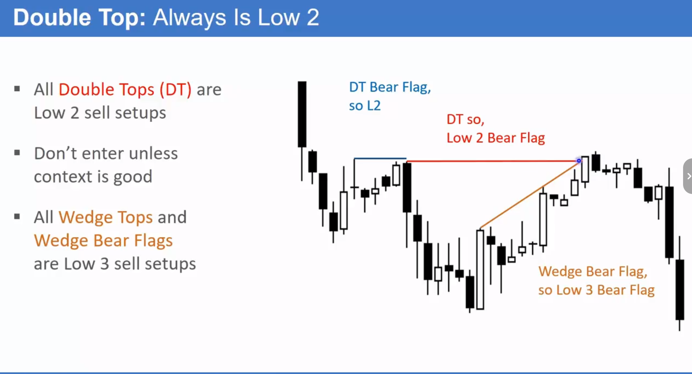
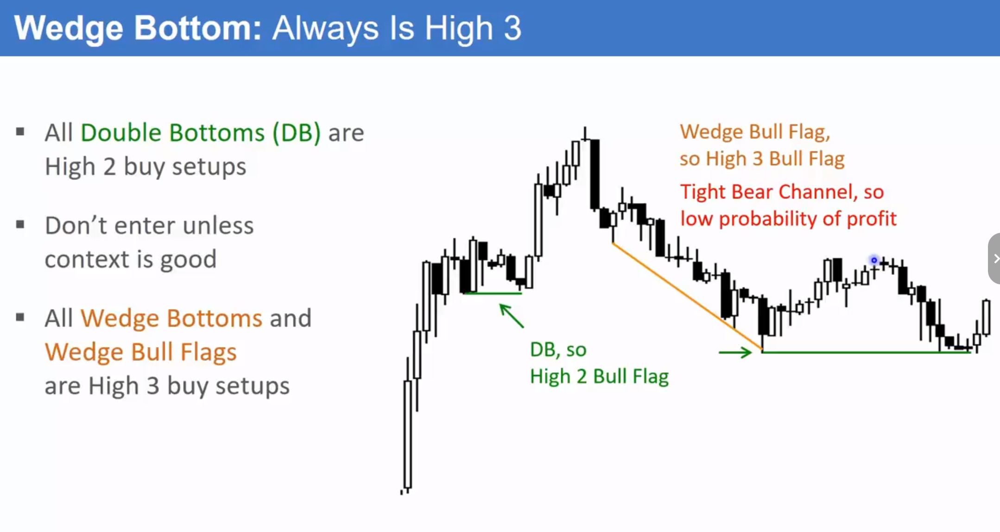

# 回调与数 K 线（第二部分）

## 双顶/双底作为旗形与反转 (Double Tops/Bottoms as Flags & Reversals)

### 定义与识别

- **核心等价关系**：
  - 所有的**双顶 (Double Top)** 本质上都是**低 2 (L2) 做空信号**。
  - 所有的**双底 (Double Bottom)** 本质上都是**高 2 (H2) 做多信号**。
  - 所有的**三推楔形顶/底 (Wedge Top/Bottom)** 本质上是**低 3 (L3) / 高 3 (H3) 信号**。
- **情境决定名称**：
  - **旗形 (Flag)**：在既有趋势中形成的形态。例如，下降趋势中的双顶是**双顶熊旗**；上涨趋势中的双底是**双底牛旗**。
  - **反转 (Reversal)**：在趋势末端，尝试改变趋势方向的形态。例如，上涨趋势中出现的双顶是**双顶反转**的尝试。
- **形态的灵活性**：完美的双顶/双底很少见，第二个顶点/低点可能略高或略低，但只要结构意图明显，仍可按双顶/双底模式处理。
  
  

### 交易含义

- **交易方法统一**：无论一个形态被称为“旗形”还是“反转”，其交易方法是相同的——在双顶处寻找做空机会，在双底处寻找做多机会。
- **目标位测算**：双顶/双底形成后，一个常见的盈利目标是基于形态高度的**等距测算 (Measured Move, MM)**。
- **情境至上**：只有在正确的市场背景下（如趋势、通道宽度）交易这些形态，胜率才会高。

## 复合型反转结构 (Complex Reversal Patterns - H4/L4)

### 概念与形成

- **定义**：指市场连续多次、以复合形态（通常包含 2-3 个小波段）尝试筑顶或筑底的结构，常被称为**高 4/低 4 (H4/L4) 反转**的变体。
- **典型结构**：通常是“一个 H2/L2 + 另一个 H2/L2”。例如，市场形成一个高 2 牛旗的尝试，但失败并向下跌破；随后，市场再次形成一个新的、更高概率的高 2 筑底尝试。
- **核心逻辑**：第一次筑顶/底的尝试失败后，紧随其后的第二次尝试成功概率更高。

### 交易含义

- **高胜率信号**：当市场形成第二个复合型顶部/底部并出现反转信号时，这通常是一个高胜率的交易机会，预示着至少会有两段式的反向运动。
- **多周期视角**：当前时间周期（如 5 分钟图）上复杂的 H4/L4 结构，在更高的时间周期（如 15 分钟图）上可能简化为一个清晰的 H2/L2 信号。
- **交易策略**：
  - 激进交易者可能在第一次尝试时入场，若失败则止损离场，并准备在第二次更高概率的尝试中重新入场。
  - 保守交易者则会耐心等待第二个复合结构形成后的明确信号再入场。

## 交易策略与情境考量 (Trading Strategies & Contextual Considerations)

### 强趋势 vs. 震荡区间

- **强趋势（窄通道）**：
  - **原则**：80%的反转尝试会失败。在极强的单边趋势（窄通道）中，不应逆势交易。
  - **策略**：不要去数逆势的 H1/H2/H3（如在强劲下跌中数高 1/高 2/高 3），而应将所有反弹都视为旗形，专注于寻找顺势的 L1/L2 做空信号。
- **弱趋势（宽通道/震荡区间）**：
  - **特征**：即使出现强劲的逆势 K 线（大阳线/大阴线），只要未能突破前高/前低，市场仍可能处于宽通道或震荡中。
  - **策略**：双顶/双底等反转形态的可靠性增加，可在区间上下沿寻找高抛低吸的机会。

### 入场与风险管理

- **胜率与盈亏比的权衡**：
  - **早期入场**：在信号 K 线处入场，风险（止损距离）较小，盈亏比好，但胜率相对较低。
  - **等待确认**：等待价格突破颈线并出现跟随 K 线后再入场，胜率更高，但入场点差，风险（止损距离）更大。
- **重新评估**：当市场出现意外的强势突破（如强势突破一个看似可靠的顶部形态），必须重新评估，预期至少还有第二段延续的行情。

## 总结原则

- **形态即信号**：双顶/双底/楔形是可交易的 H2/L2/H3 信号，其本质比名称更重要。
- **情境决定一切**：在强趋势中，顺势而为，将所有逆势形态视为旗形。在弱趋势或震荡中，反转形态的价值凸显。
- **关注失败后的机会**：一个形态的失败（如 H2 失败）往往孕育着下一个更高概率的交易机会（如 H4）。
- **简化复杂性**：当图表结构复杂时，切换到更高时间周期观察，有助于抓住核心模式。
