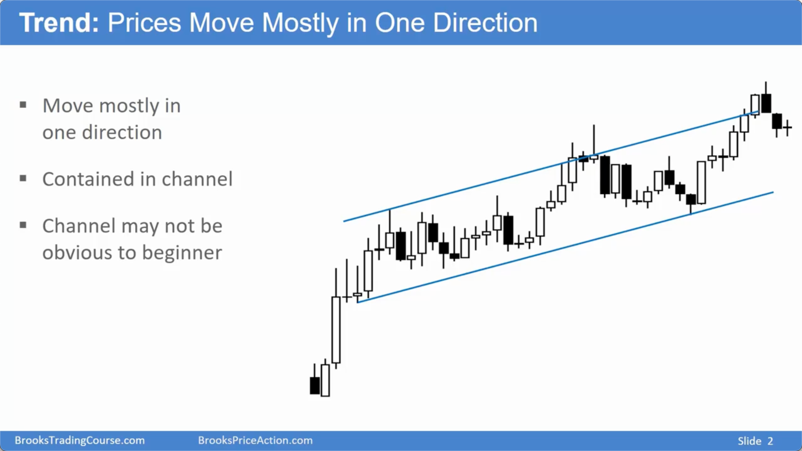
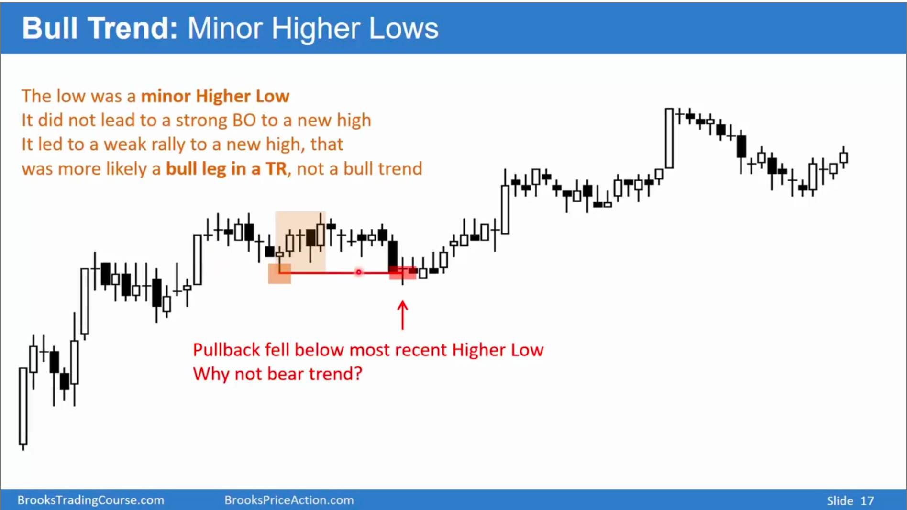
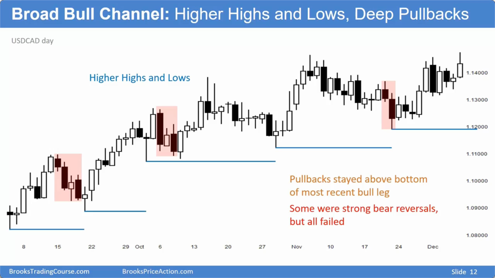
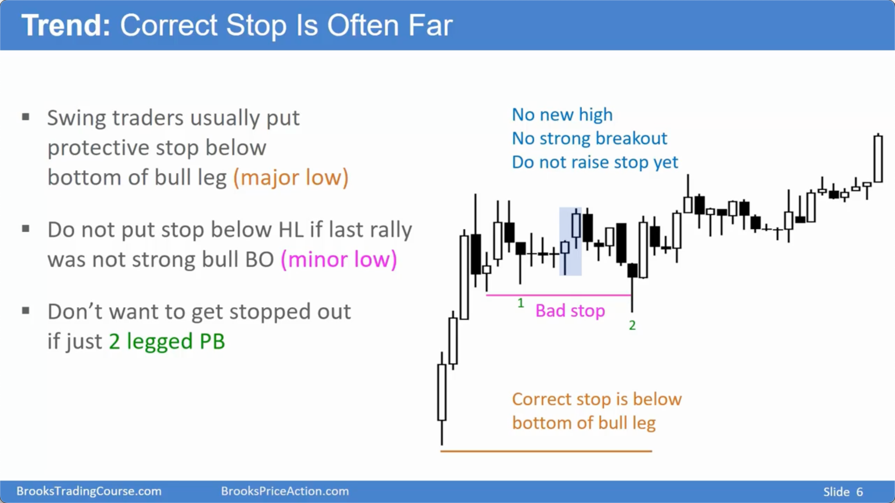
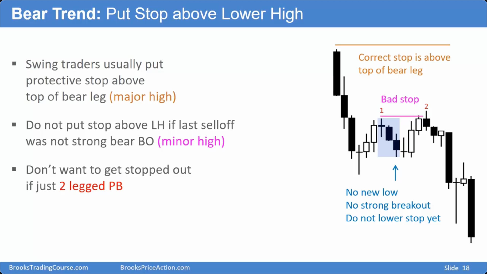
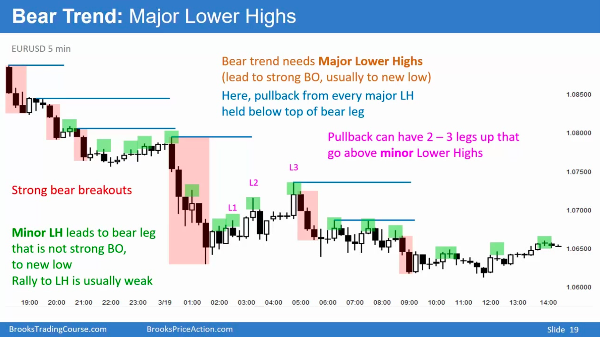
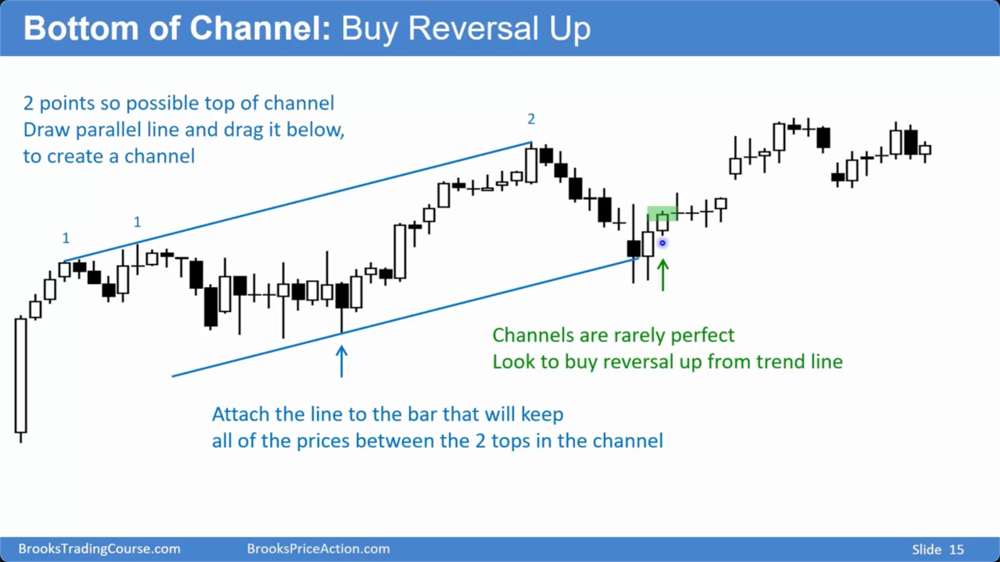
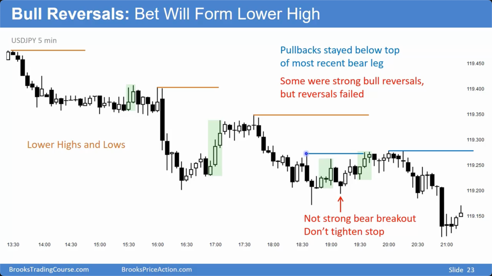
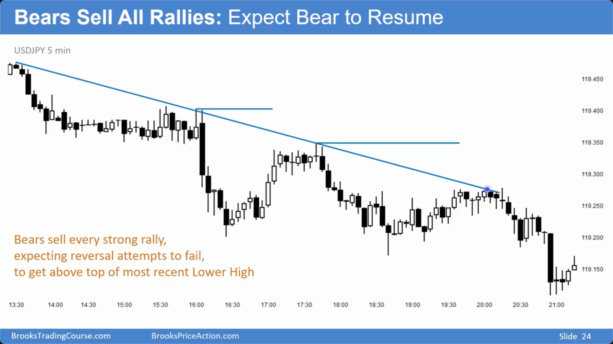
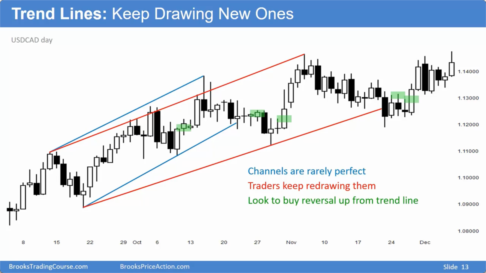

# 趋势入门

## 趋势的定义与通道 (Definition & Channels)

### 基本概念

- **定义**：趋势是价格主要向一个方向持续移动的状态，例如从左下角到右上角（上涨趋势）或从左上角到右下角（下降趋势）。
- **主要趋势 vs. 波段**：讲师通常用“趋势”指代图表上持续时间较长、方向明确的**主要趋势**。较短的、次要的、与主趋势方向相反或一致的移动则称为“波段” (Swing/Leg)。
- **通道 (Channel)**：所有趋势都在某种通道内运行。通道由两条线构成： - **趋势线 (Trend Line)**：上涨趋势中连接低点的线；下降趋势中连接高点的线。 - **趋势通道线 (Trend Channel Line)**：与趋势线大致平行的另一条线，构成通道的边界。
  

## 上涨趋势：不断抬高的低点 (Uptrends: Higher Lows)

### 核心特征与止损管理

- **核心特征**：不断抬高的低点 (Higher Lows) 是上涨趋势最关键的特征，它比不断抬高的高点 (Higher Highs) 更重要，因为它决定了趋势的有效性和交易者的止损位置。
- **重要低点 (Major Swing Low)**：一个低点之后，若出现了**强劲的多头突破**并**创出新高**，该低点即成为“重要低点”。这是波段交易者和剥头皮交易者放置止损的**正确位置**。
- **次要低点 (Minor Swing Low)**：一个低点之后，没有出现强劲突破或未能创出新高。在此下方设置止损是**错误**的，因为市场很可能在跌破该点后继续上涨，导致不必要的止损。
- **趋势变化信号**：
  - **跌破次要低点**：趋势并未结束，但可能减弱，表现为通道变得更宽、更平缓。
  - **跌破重要低点**：上涨趋势的前提失效，市场大概率已转变为**震荡区间**，或在少数情况下直接反转为下降趋势。
    
    

## 下降趋势：不断降低的高点 (Downtrends: Lower Highs)

### 核心特征与止损管理

- **核心特征**：不断降低的高点 (Lower Highs) 是下降趋势的决定性特征，是空头设置止损的依据。
- **重要高点 (Major Swing High)**：一个高点之后，若出现了**强劲的空头突破**并**创出新低**，该高点即成为“重要高点”。这是空头放置止损的**正确位置**。
- **次要高点 (Minor Swing High)**：一个高点之后，没有强劲的空头突破。在此上方放置止损容易被市场在恢复下跌前扫掉。
- **趋势变化信号**：
  - **突破次要高点**：下降趋势可能在减弱，通道变宽、变平。
  - **突破重要高点**：下降趋势的前提失效，市场大概率已进入**震荡区间**。

## 趋势中的交易策略 (Trading Strategies Within Trends)

### 顺势交易

- **上涨趋势中**：多头会在回调至趋势线附近或前一轮上涨波段的中间区域时寻找买入机会。他们预期空头的反转尝试会失败，并将这些失败的尝试视为加仓信号。
- **下降趋势中**：空头会在反弹至趋势通道线上轨附近时寻找做空机会，押注多头的反弹会失败并演变为熊旗。
  
  
  

### 通道行为

- **通道突破失败**：当价格加速突破一个**窄通道**（抛售高潮或购买高潮）时，有高达 75%的概率会失败，并反弹/回调至通道的另一侧或进入震荡区间。这通常是趋势衰竭的信号，而非新趋势的开始。
- **动态调整**：趋势线和通道线很少是完美的，交易者需要随着新 K 线的出现而动态调整画线，以更好地反映当前的市场结构。
  

## 总结原则

- **高点/低点是关键**：上涨趋势的生命力在于守住重要的更高低点；下降趋势则在于守住重要的更低高点。
- **区分重要与次要**：正确识别**重要**波段高/低点对于设置有效的、不易被市场噪音触发的止损至关重要。
- **趋势的终结通常是震荡**：强劲的趋势很少会直接 V 型反转。当趋势的关键高/低点被突破时，市场最有可能进入**震荡区间**，为多空双方提供一个重新平衡力量的阶段。
- **通道是行为指南**：利用通道来识别高概率的交易区域（在通道边缘顺势交易），并警惕趋势加速（通道突破）可能带来的反转风险。
