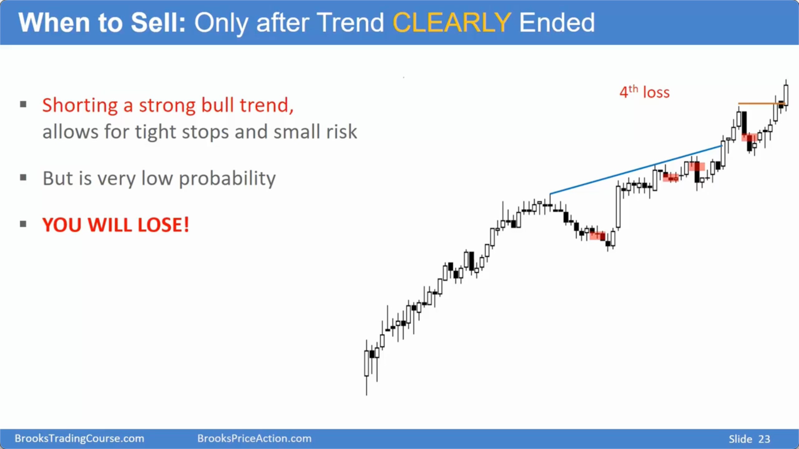
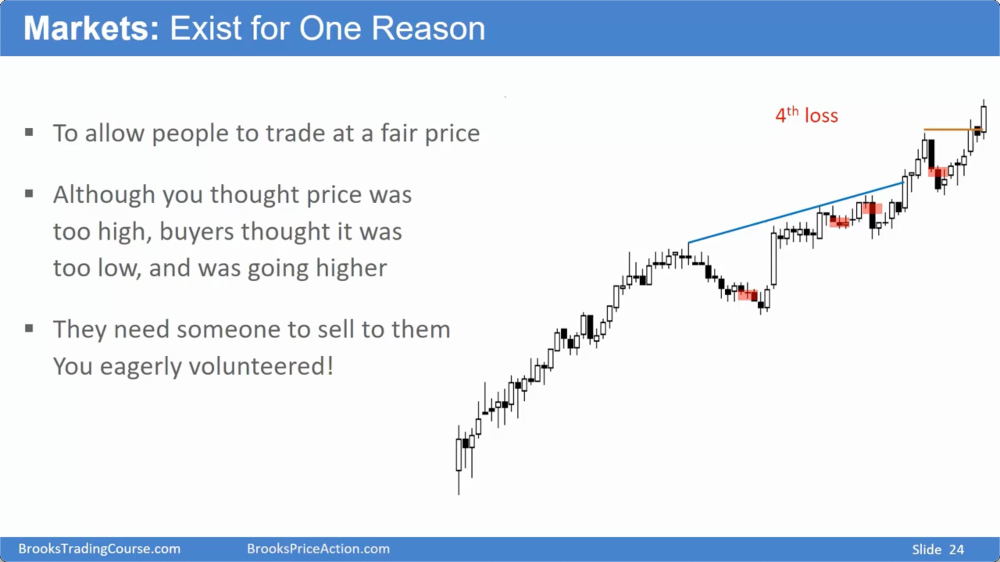
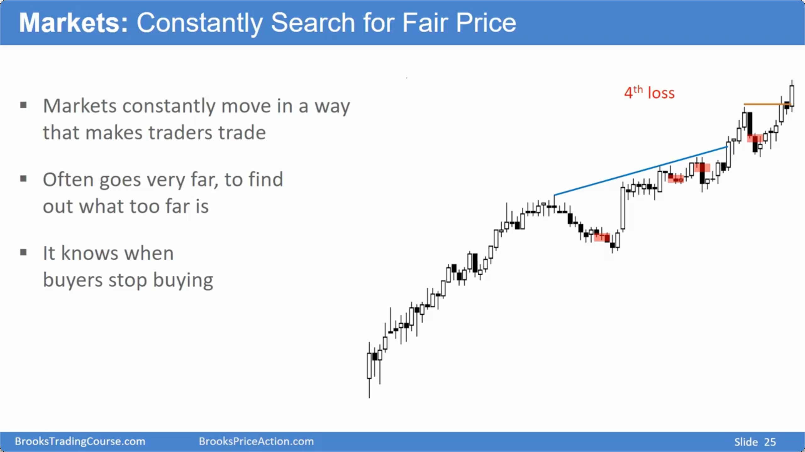
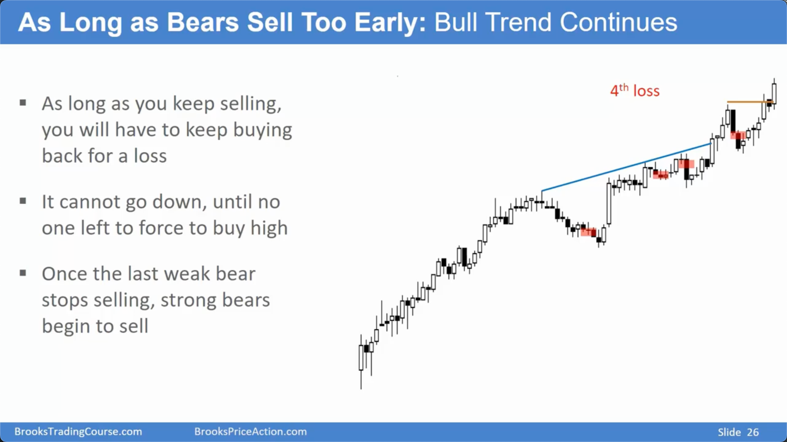

# 趋势（第二部分）

## 识别趋势与震荡区间

### 基本原则
-   **核心判断标准**：如果你看不懂图表，无法明确判断多空方向，那么市场就处于 **震荡区间** (Trading Range)。
-   **震荡区间的特征**：
    -   多空双方都有看似合理的交易理由。
    -   图表同时包含上涨和下跌趋势的早期特征（如，既有降低的高点，又有抬高的低点）。
-   **趋势中的震荡**：强势趋势中同样包含小的震荡区间，即 **回调** (Pullback) 或暂停，这在小时间周期图上更为明显。

### 震荡区间的演变
-   **时间因素**：当一个震荡区间持续超过 **20根K线**，原趋势反转的概率会逐渐接近50%，与趋势延续的概率持平。
-   **交易策略**：在明确的趋势性突破发生前，应按震荡区间策略进行交易。

## 趋势的结构：突破与通道

### 突破阶段 (Breakout)
-   **定义**：趋势中最强劲、最明确的部分，通常表现为一根或多根实体巨大的K线，显著突破前期盘整区。
-   **交易含义**：
    -   **市场状态改变**：一旦出现强力突破，意味着市场从震荡转为趋势，继续朝突破方向运动的概率极高。
    -   **高胜率 vs. 大风险**：突破是高胜率的入场信号，但通常伴随着巨大的K线，导致止损位很远，风险较大。
    -   **应对策略**：必须参与交易，但要通过 **减小仓位** 来管理风险。不要因害怕大止损而等待回调，否则可能错过整个趋势。

### 通道阶段 (Channel)
-   **定义**：突破之后，趋势以较窄的通道形式延续，伴随着短暂、浅度的回调。
-   **特征**：
    -   回调通常只持续1-2根K线。
    -   逆势信号K线（如做空的信号）通常很弱。
    -   在更高级别的时间周期图上，这种窄通道本身就是一次 **突破**。

## 80%法则：为何逆势交易是陷阱

### 核心法则
-   **惯性原理**：市场具有惯性。如同80%的震荡区间突破会失败一样，在强势趋势中，**80%的反转尝试都会失败**。
-   **失败的反转 = 顺势旗形**：在强上涨趋势中，所有看起来像顶部形态（如三推楔形顶、双顶）的结构，都极大概率会失败，最终演变成 **牛旗** (Bull Flag)，成为趋势延续的信号。

### 新手的常见错误
-   **错把牛旗当顶部**：新手在强趋势中看到回调或反转形态，就认为是趋势即将结束，从而过早地进行逆势交易。
-   **执着于小风险**：为了追求小止损，新手反复在强趋势中逆势开仓。虽然单次风险小，但由于胜率极低（约20%），反复止损会导致“**千刀万剐式的亏损**”。
-   **心理误区**：认为“涨太多了必然会跌”，并以此为交易依据，而忽略了图表上压倒性的顺势证据（如窄通道、无像样的反向K线）。

## 正确的趋势交易策略

### 顺势而为
-   **只做顺势单**：在强劲的单边趋势中，应 **只寻找同方向的交易机会**。强上涨中只做多，强下跌中只做空。
-   **立即行动**：看到强力突破时，要果断入场（市价单、突破单），不要犹豫和等待。
-   **利用回调**：将回调视为 **买入机会**，而不是反转信号。多头获利了结导致了回调，而这恰好为踏空的多头提供了入场点。

### 风险与仓位管理
-   **设置硬止损**：必须在系统中设置实际的保护性止损单，不能只放在脑子里。合理的止损位在信号K线下方或波段起涨点下方。
-   **仓位调节**：当止损空间变大时（如突破行情），通过 **减小仓位** 来将实际风险控制在可接受范围内。这是专业交易者与新手的核心区别之一。

### 总结原则
-   **看不懂就是震荡**：当市场方向不明确时，默认其为震荡区间。
-   **突破必须跟随**：强力突破是高概率的趋势延续信号，应通过减小仓位来参与，而不是观望。
-   **80%法则至上**：坚信在强趋势中，绝大多数反转尝试都会失败，并成为顺势交易的良机。
-   **只做大概率的事**：避免在强趋势中进行低胜率的逆势交易，即使单次风险看起来很小。持续的低概率下注是稳定亏损的根源。