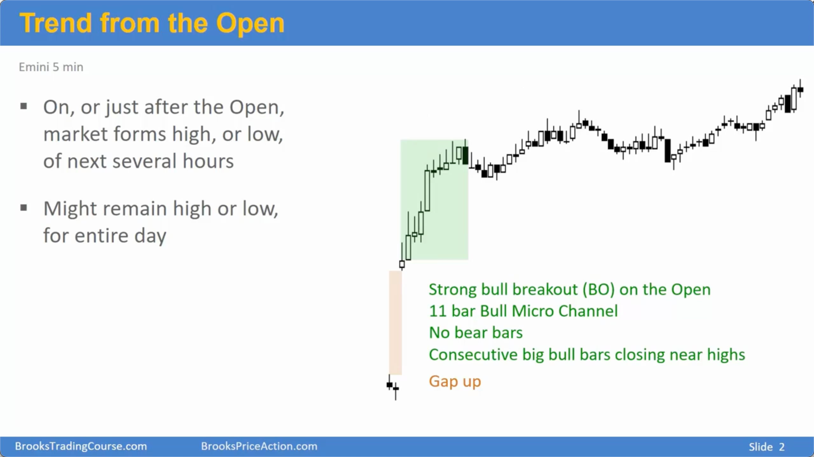
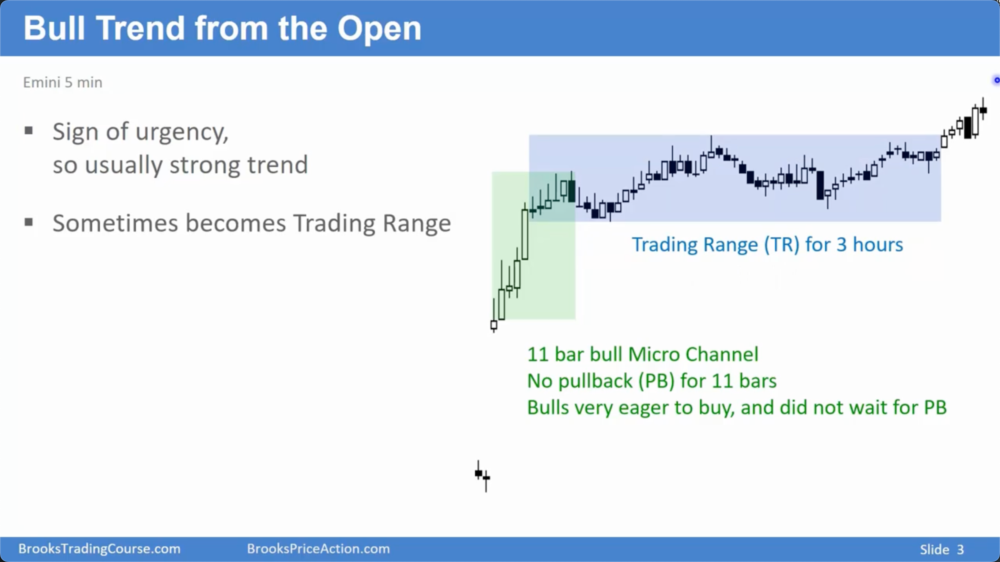
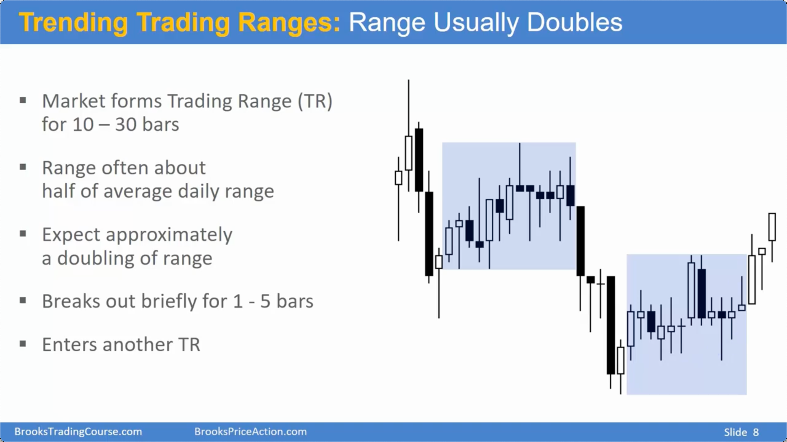
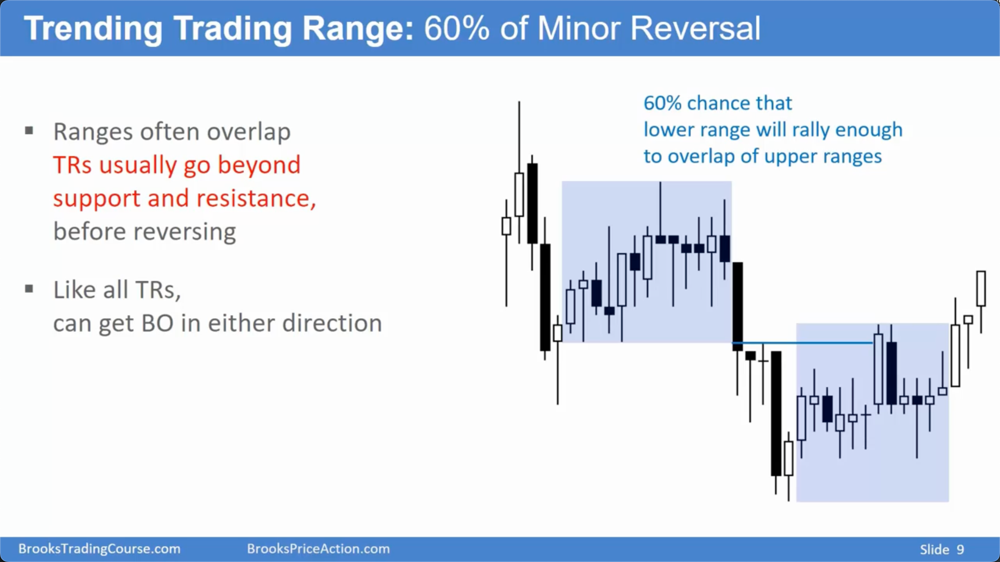
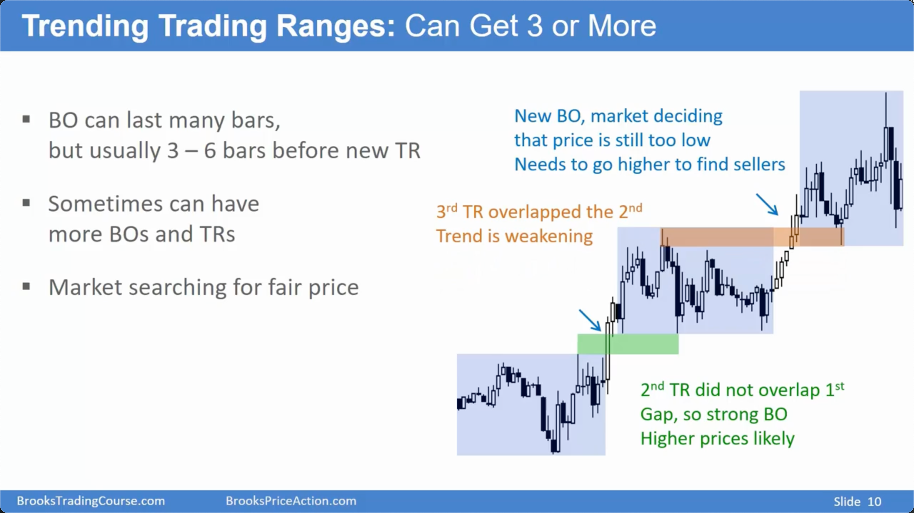
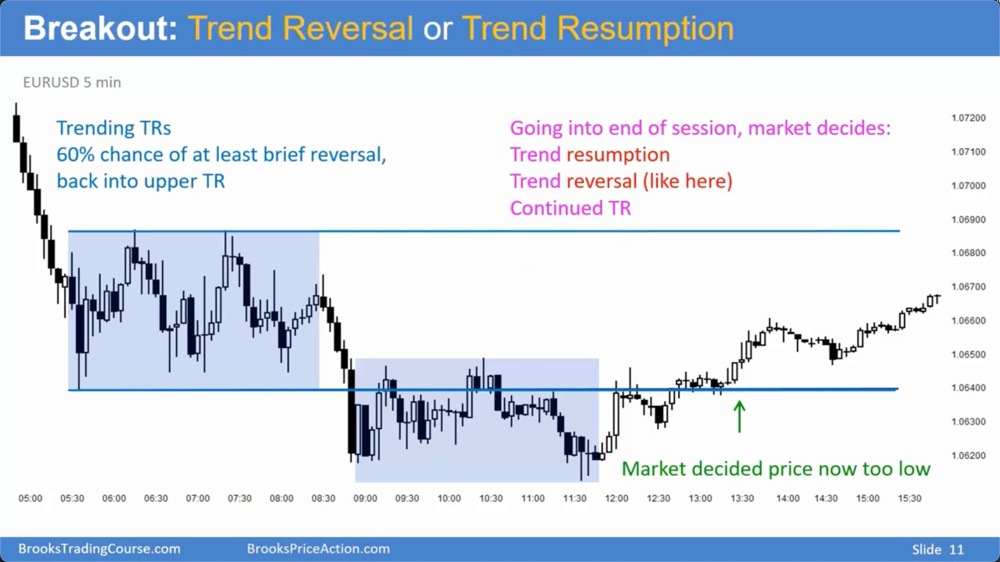
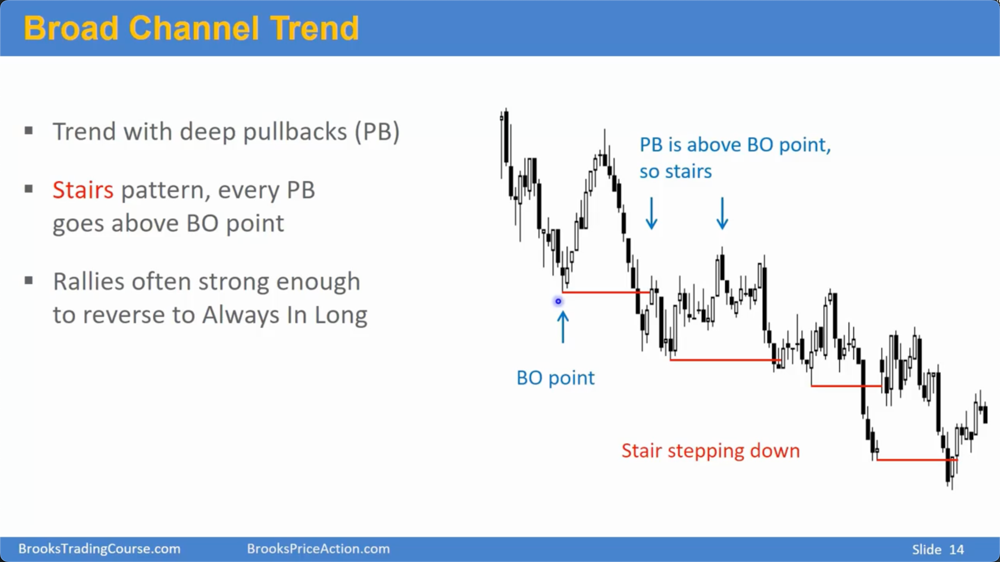
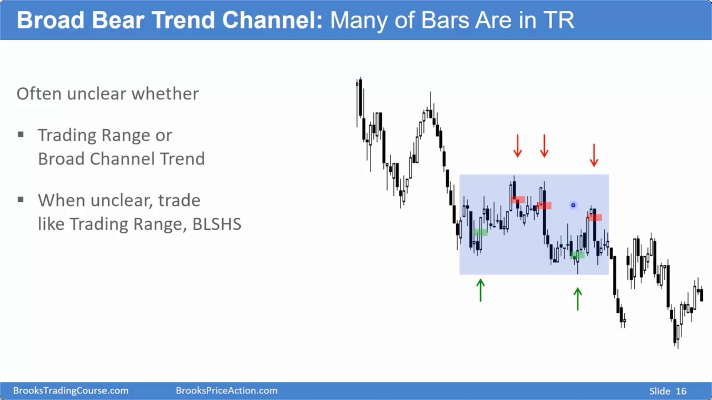
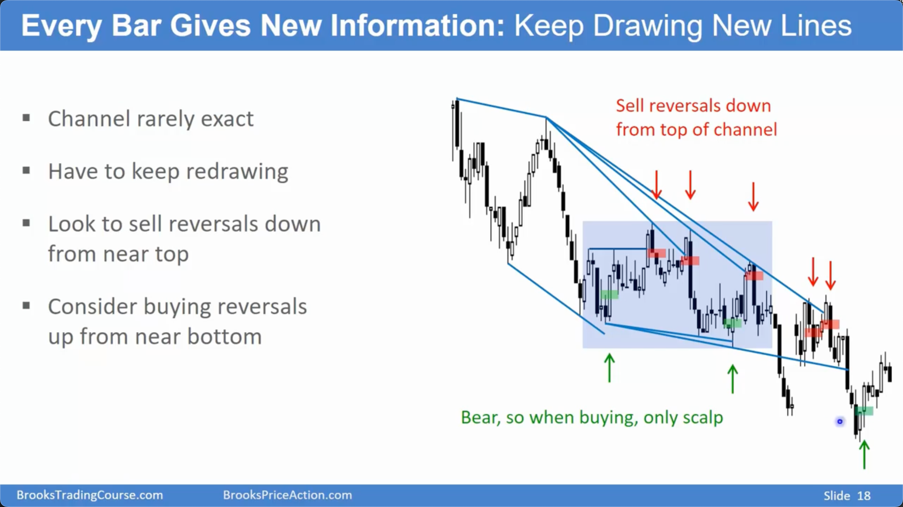
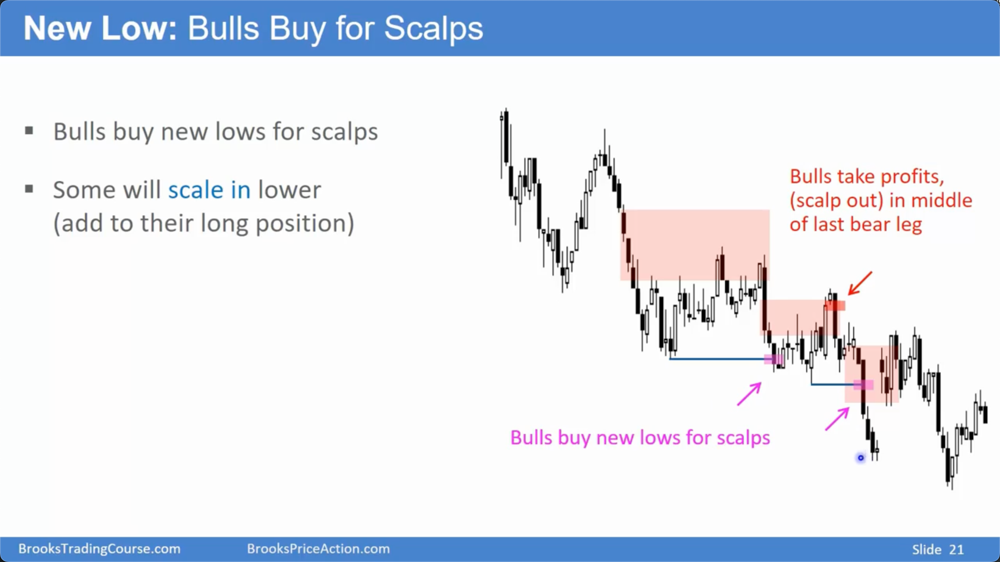

# 三种趋势类型

## 从开盘开始的趋势 (Trend from the Open)

### 定义与特征

- **概念**：一种强劲的趋势，通常在交易时段的早期（如第一个小时内）开始，但不一定是从第一根 K 线开始。
- **识别特征**：
  - **开盘紧迫感**：开盘时出现连续的、强劲的趋势 K 线（如大阳线/大阴线），显示出单边力量。
  - **极浅回调**：在趋势的初始阶段（Spike），回调非常小或几乎没有，后续 K 线低点/高点持续突破前一根 K 线。
  - **后续发展**：强劲的开盘趋势后，市场通常会横盘（进入通道或震荡区间）数小时，然后再决定是延续趋势还是反转。
- **24 小时市场应用**： - 在股票或股指期货等有明确开盘时间的市场中，此概念最适用。 - 对于外汇等 24 小时市场，由于没有统一开盘时间，Al Brooks 倾向于称其为“突破”或“急速变通道”的趋势，但其核心逻辑（活跃时段初期的强劲单边走势）是相同的。
  
  

## 震荡趋势日 (Trending Trading Range Day)

### 结构与识别

- **概念**：一种由一系列震荡区间构成的趋势。整体方向在移动，但包含了大量的双向交易。
- **典型结构**：`震荡区间 → 短暂突破 → 新的震荡区间`，如此循环。
- **特征**：
  - 开盘时形成一个初始区间，其高度通常约为平均日内波幅的一半。
  - 连接各个区间的突破通常很短暂（仅持续几根 K 线）。
    

### 交易含义与概率

- **区间重叠 (Overlap)**：有 60%的概率，后一个区间会与前一个区间发生重叠。**若不重叠（形成缺口），是趋势强劲的信号**。
- **突破模式 (Breakout Mode)**：当一个震荡区间持续超过 20 根 K 线时，市场进入突破模式，向上或向下突破的概率变为 50/50。
- **末端形态**：趋势后期的三角形形态，通常是末端旗形，有 60-70%的概率导致趋势反转。
  
  
  

## 宽通道趋势 (Trend in a Broad Channel)

### 定义与特征

- **概念**：一种趋势，其总体方向明确（如不断抬高的高点和低点），但包含非常深、强劲的回调。
- **识别特征**：
  - **阶梯模式 (Stepping Pattern)**：突破创出新高/新低后，回调会深入到突破点之内。这表明趋势较弱，逆势交易者可以盈利。
  - **双向交易特征**：由于回调深，市场同时具有趋势和震荡区间的双重特性。当不确定时，可按震荡区间策略交易（高抛低吸）。
  - **缩小的阶梯 (Shrinking Steps)**：一个重要的趋势衰竭信号。指后续的趋势腿（阶梯）比前一个更短，表明动能减弱，趋势可能即将转为震荡或反转。
    

### 交易策略

- **顺势交易者**：在深回调至前一趋势腿的中间区域时，寻找反转信号（如双底/顶、信号 K 线）入场，并在前高/前低附近止盈。
- **逆势交易者**：在通道边缘或新高/新低附近进行反向的剥头皮交易，因为“阶梯模式”提供了盈利空间。
- **通道线**：通道线很少是完美的，需要根据新的高点和低点不断重新绘制。
  
  
  

## 总结原则

- **从开盘开始的趋势**：识别开盘的“紧迫感”，这是强趋势的早期信号，但要为随后的横盘整理做好准备。
- **震荡趋势日**：通过观察区间之间的“重叠”或“缺口”来判断趋势强度，并注意超过 20 根 K 线的区间会进入 50/50 的突破模式。
- **宽通道趋势**：识别“阶梯模式”和“缩小的阶梯”。前者是双向交易的机会，后者是趋势即将结束的警示。
