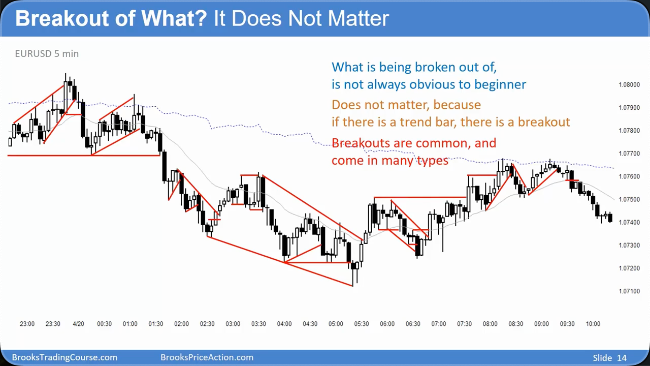
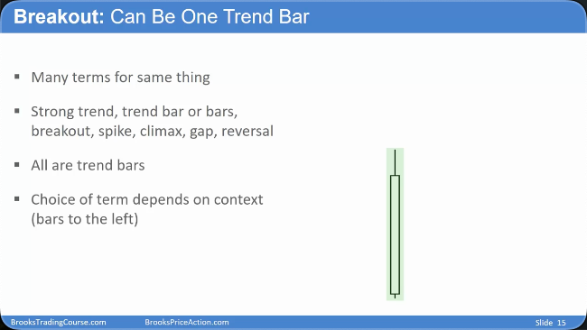
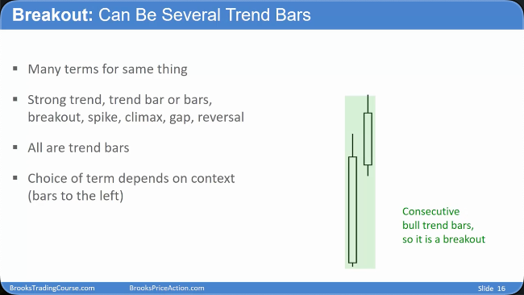
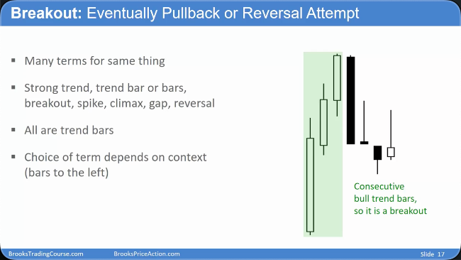
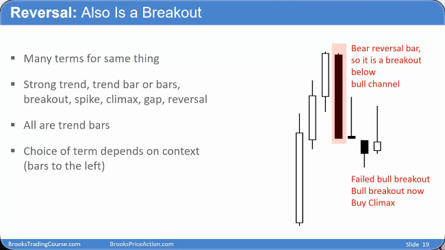
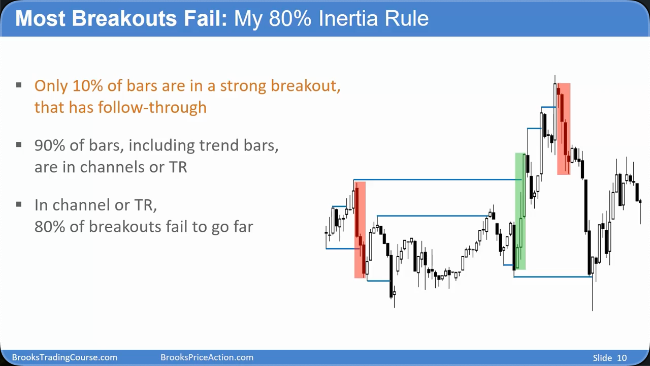
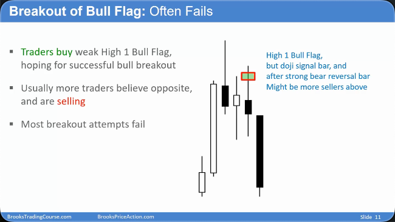
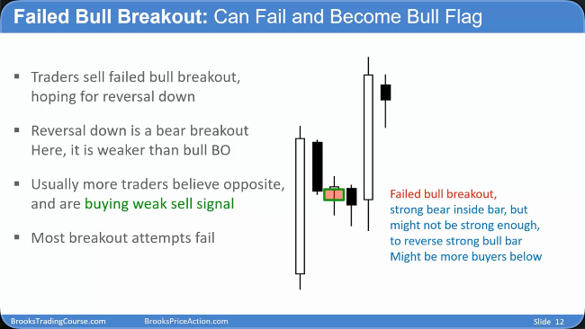
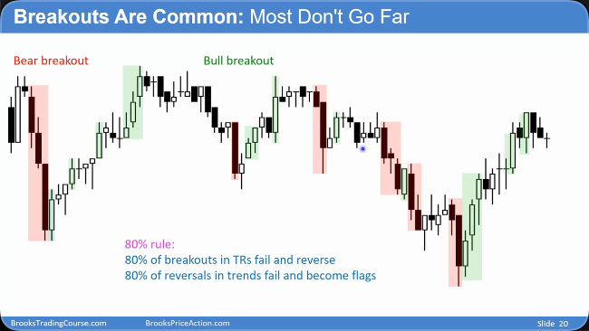
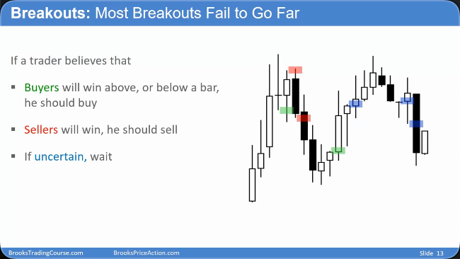

# 突破导论

## 突破的核心定义 (Core Definition of a Breakout)

- **概念**：突破是由一根或一系列趋势 K 线（即大阳线/大阴线）组成，其价格强势超越了某个支撑或阻力位。
- **突破对象**：
  - **前一根或多根 K 线的最高点/最低点。**
  - **趋势线或通道线。**
  - **移动平均线 (Moving Average, EMA20)。**
  - **前期的重要高点或低点（Swing High/Low）。**
- **普遍性**：图表上每一根大的趋势 K 线都是一次突破。突破的支撑/阻力位越多，信号越强。
- **K 线影线**：每根 K 线的上、下影线都代表一次在更小时间周期上失败的突破尝试。

## 突破了什么

### can be one trend bar

### can be several trend bar

## 反转即突破 (Reversals are Breakouts)

- **内在联系**：每一次反转（Reversal）的尝试，本质上都是一次反方向的突破尝试。
- **示例**：一轮上涨后的强力大阴线，既是多头突破失败的信号，也是一次空头突破（反转）的开始。
- **分析视角**：应将反转 K 线视为突破 K 线进行分析，关注其强度、收盘位置和后续 K 线的确认。
  

## 市场惯性：80% 法则 (Market Inertia: The 80% Rule)

- **核心思想**：市场具有强大的惯性，倾向于维持当前状态，约 80%的改变尝试会失败。
- **具体应用**：
  - **震荡区间 (Trading Range)**：约 80%向上或向下的突破尝试会失败，价格会重新回到区间内。
  - **趋势 (Trend)**：约 80%的反转尝试会失败，原趋势会继续。
- **交易启示**：这是价格行为分析的基石。在交易前，首先要判断市场处于趋势还是震荡，并假设当前状态会持续。
  
  
  
  

## 震荡区间中的突破交易策略 (Trading Strategy for Breakouts in a Range)

- **核心策略**：基于“80%的突破会失败”原则，在震荡区间的边界进行逆势交易（Fading）。
- **具体操作**：
  - **高抛 (Sell High)**：当价格以强劲阳线（抢购高潮, Buying Climax）冲向区间顶部时，将其视为陷阱，寻找做空机会。
  - **低吸 (Buy Low)**：当价格以强劲阴线（抛售高潮, Selling Climax）砸向区间底部时，将其视为陷阱，寻找做多机会。
- **入场方式**：
  - **激进**：直接在强突破 K 线的收盘价反向入场。
  - **稳健**：等待反转信号 K 线出现后，再顺着反转方向入场。
- **交易目标**：由于预计市场将继续震荡，主要目标是剥头皮（Scalp）获取短线利润。
  

## 总结原则

- **突破无处不在**：任何强趋势 K 线都是一次突破，反转也是突破的一种形式。
- **惯性是关键**：牢记 80%法则——震荡区间的突破大多会失败，趋势中的反转大多会失败。
- **情景决定策略**：在震荡区间中，应逆向思考，利用失败的突破进行高抛低吸的剥头皮交易，而不是追涨杀跌。
- **确认至上**：突破的强度和其后的跟随 K 线（Follow-through）至关重要。糟糕的跟随是突破失败的强烈信号。如果不确定，最好的选择是等待。
