# 突破（第二部分）：跟随与确认

## 突破与跟随 K 线 (Breakouts and Follow-Through Bars)

### 确认的重要性 (The Importance of Confirmation)

- **核心概念**：任何突破（无论是向上还是向下）若要成功，其后必须有同方向的**跟随 K 线 (Follow-through Bar)** 作为确认。
- **成功的信号**：
  - 跟随 K 线是强劲的同向 K 线（如大阳线/大阴线，收盘价接近极值）。
  - 良好的跟随会显著增加趋势延续的概率，并可能引导价格到达**测量型移动 (Measured Move, MM)** 的目标位。
- **失败的信号**：
  - 跟随 K 线是反向 K 线（如突破向上后出现阴线）。
  - 这表明突破很可能**失败**，市场可能会反转或进入震荡。
    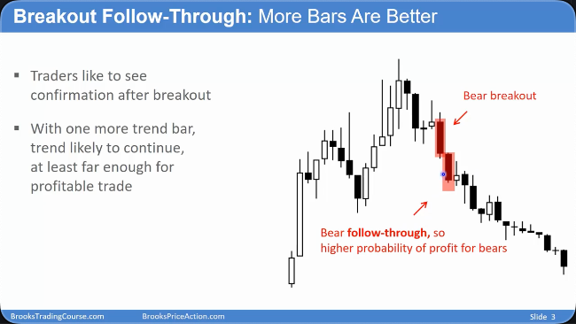
    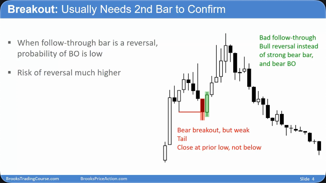

## 交易者心理与行为 (Trader Psychology and Behavior)

### 顺势与逆势的博弈 (The Battle Between With-Trend and Counter-Trend)

- **“80%法则”**：在趋势中，大约 80%的反转尝试会失败。因此，顺势交易者会利用这一点。
- **逆势交易者策略**：当趋势中出现反向信号 K 线时（如上涨趋势中的大阴线），逆势交易者会尝试推动反转，而顺势交易者则会在此 K 线的收盘价附近入场，**押注反转会失败**（即不会出现跟随 K 线）。
- **拉锯点**：跟随 K 线的位置是多空双方的关键战场。顺势方需要它来确认趋势，逆势方则全力阻止它的出现。
- **“放弃”K 线 (Give-up Bar)**：当突破和跟随非常强劲时，一直坚持做空的逆势交易者会最终“放弃”并回补仓位（买入平仓）。这股买盘力量与顺势交易者的买盘汇合，会造成价格急剧加速上涨，形成**高胜率的入场点**。

### 失败的 reversal 会成为 bull/bear flag (pullback)

- 高盈亏比 止损很小 意味着概率很低
- reversal need one more bar
  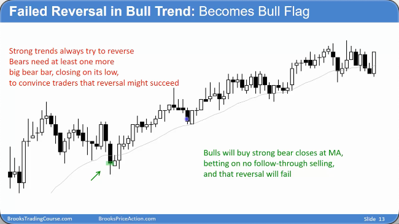
  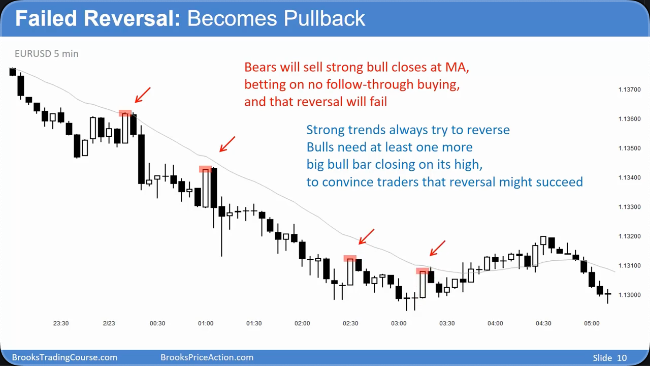
  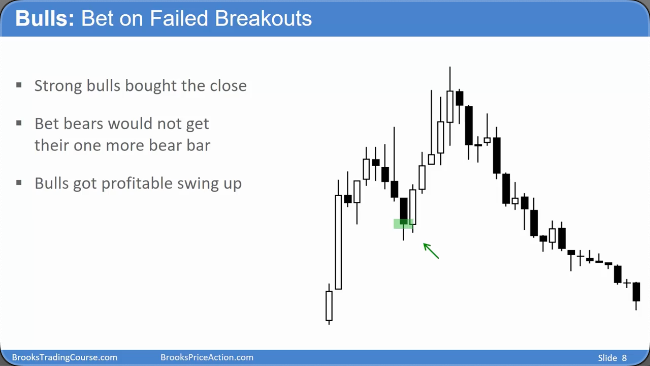

### 多次尝试 reversal

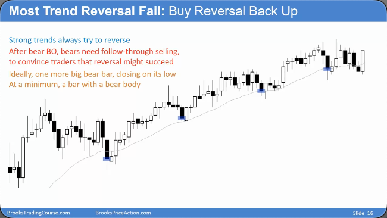
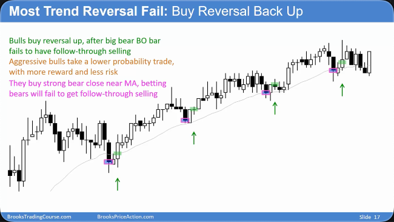

## 突破的形态与特征 (Forms and Characteristics of Breakouts)

### 突破的多样性 (The Diversity of Breakouts)

- **单根 K 线突破**：由一根强劲的趋势 K 线构成。
- **微通道突破**：**由一系列没有回调的小 K 线组成，它们共同构成一个突破。在更高的时间周期图表上，这通常会显示为一根或几根强劲的 K 线。**
- **反转即是突破**：每一次趋势反转，本质上都是对前期某个结构（如趋势线、通道）的突破。
- **跳空缺口 (Gaps)**：尤其在股票市场，开盘跳空缺口也是一种突破形式，同样遵循成功或失败的规律。
  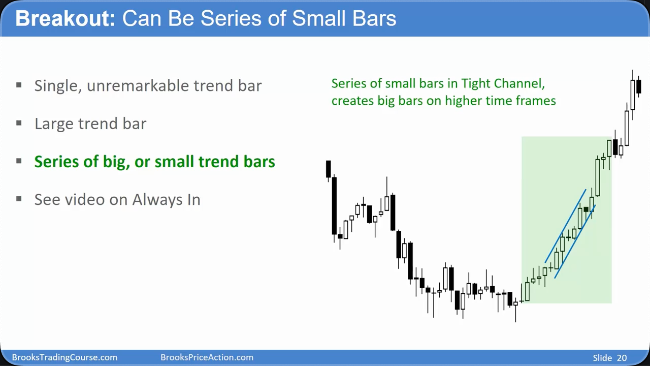
  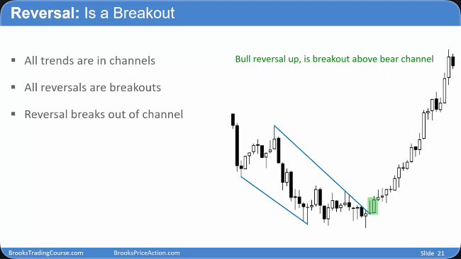
  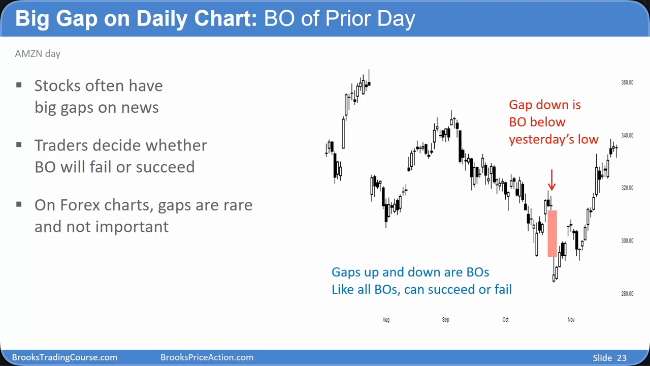

### follow through

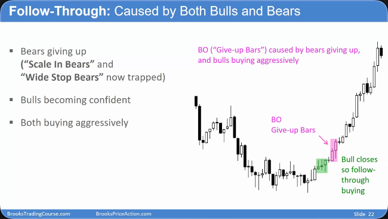

## 突破交易的策略与管理 (Strategy and Management for Breakout Trading)

### 入场与风险 (Entry and Risk)

- **高概率入场**：在强劲的突破行情中（例如，连续出现大阳线），采取**“买收盘价 (Buy The Close)”**策略，即在阳线收盘时立即市价买入，是一种高胜率的交易方式。
- **缺点与挑战**：
  - **止损远**：强突破通常意味着止损需要放在较远的位置（如趋势的起涨点），导致单笔风险较大。
  - **情绪压力**：追涨杀跌对交易者的心理是巨大的考验。
- **解决方案**：
  - **调整仓位**：必须根据较宽的止损距离，**使用非常小的仓位**进行交易，确保即使亏损，金额也在可控范围内。

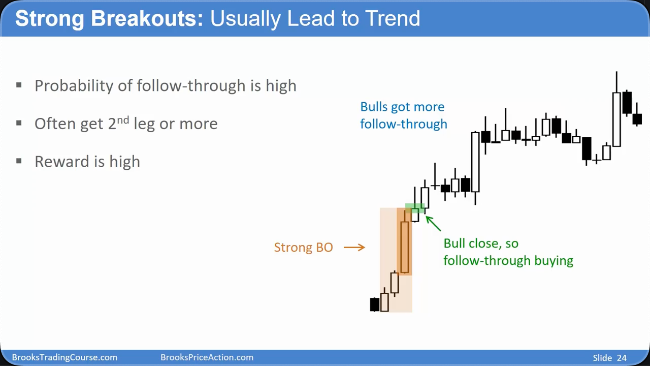

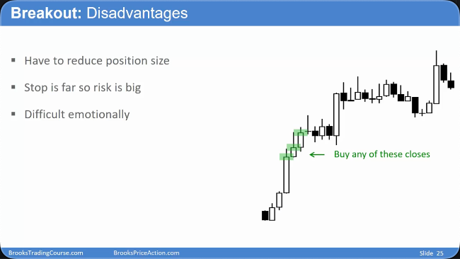

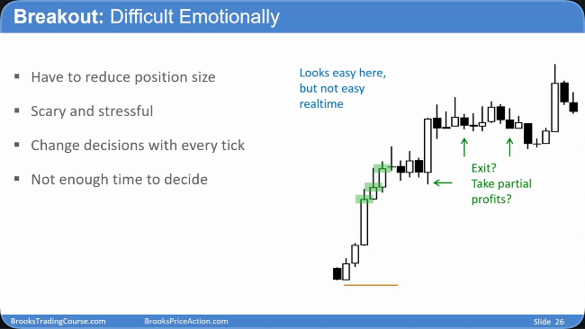

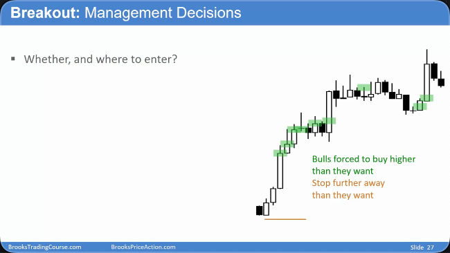

### 持仓与目标 (Holding and Targets)

- **避免过早离场**：在强趋势中，频繁地剥头皮式（Scalp）止盈可能导致踏空后续更大的行情，因为再次入场很困难
- **使用非常小的仓位**：突破交易的止损很大 所以如果使用宽止损如果仓位过大会拿不住 或者 风险太大，所以需要使用小仓位&正确的止损
- **止损问题**：突破经常会回测突破的起点 所以需要使用正确的止损
- **持仓原则**：只要趋势有效的前提没有被打破（即没有出现强力的反转信号），就应该**坚定持有**。
- **盈利目标**：一个常见且概率较高的目标是基于突破形态计算出的**测量型移动 (MM)** 距离。

## 总结原则

- **跟随是关键**：突破 K 线之后的跟随 K 线，是判断突破成败最重要的依据。
- **理解博弈心理**：认识到市场是顺势和逆势交易者不断博弈的结果，尤其是在关键的跟随 K 线位置。
- **突破形态多样**：突破可以是一根大 K 线，也可以是一系列小 K 线，甚至是跳空缺口。
- **风险管理至上**：强趋势突破是高胜率交易，但这必须与严格的**小仓位管理**相结合，以应对其固有的宽止损和心理压力。
