# 突破与陷阱 (第四部分)

## 第 2 段陷阱 (Second Leg Trap)

### 定义与识别

- **概念**：市场走出一个波段后，经过回调/反弹，形成一个看起来非常强劲、似乎要延续趋势的第 2 段行情，但最终却失败并反转。
- **常见背景**：在**震荡区间 (Trading Range)** 或宽通道中极为常见。
- **目的**：诱使交易者误以为趋势将要启动，从而在高位追多或在低位追空，最终被套牢。
- **识别信号**： - **强劲假象**：第 2 段行情通常由一两根实体很大的趋势 K 线构成，看起来突破意图明确。
- **关键败笔**：突破后缺乏强有力的**跟随 (Follow-through)**，反而迅速出现一根强劲的反转 K 线。
  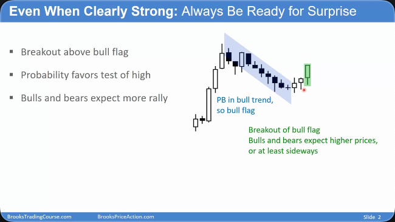
  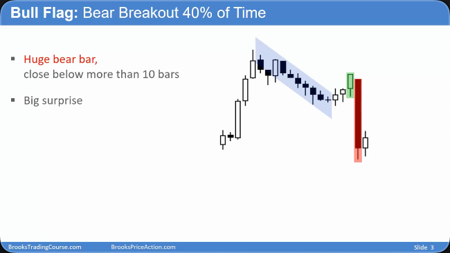

  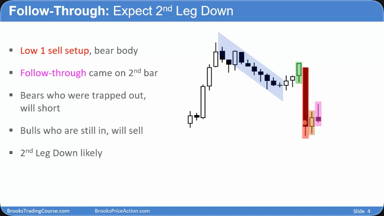
  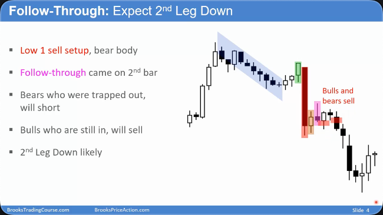

### 交易含义

- **保持怀疑**：在震荡区间内看到**强劲**的突破时，要首先怀疑它可能是第 2 段陷阱。
- **反向交易**：一旦识别出陷阱（即突破后出现糟糕的跟随和强反转信号），应考虑反向操作（Fading），即在顶部卖出，在底部买入。
- **关注背景**：“看左边”至关重要。如果左侧是明显的震荡区间，那么任何突破失败的概率都很高。
  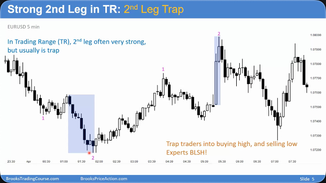

  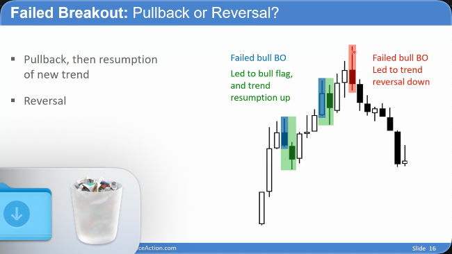

## 判断突破的成败

### 核心理念

- **概率思维**：市场上没有 100% 的确定性，大多数情况的概率在 40%-60% 之间。必须时刻为意外情况做准备。
- **市场本质**：市场通过不断的突破尝试来寻找公允价值。因此，判断突破会成功还是失败，是所有交易决策（入场、止损、止盈）的基础。
- **失败是常态**：每一个趋势最终都以一次失败的突破而告终。K 线上的长影线本身就是一次微型的、失败的突破。
  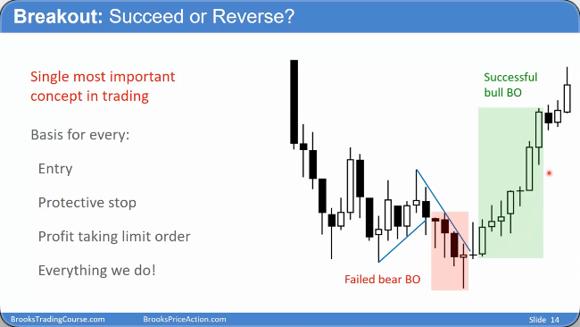
  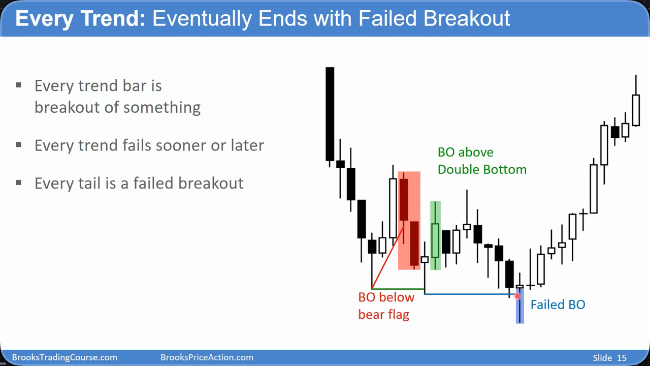

### 强突破的特征

- **连续性与力度**：出现连续多根实体饱满、收盘价接近极值的趋势 K 线。
- **紧迫性**：出现跳空缺口（如阳线开盘价高于前一根 K 线的收盘价），表明买方/卖方非常急迫，不愿等待回调。
- **首次回调弱势**：在一次强劲的突破后，首次出现的回调/反弹通常是微弱的，很大概率只是一个旗形（牛旗/熊旗），是趋势延续的信号，而非反转。

  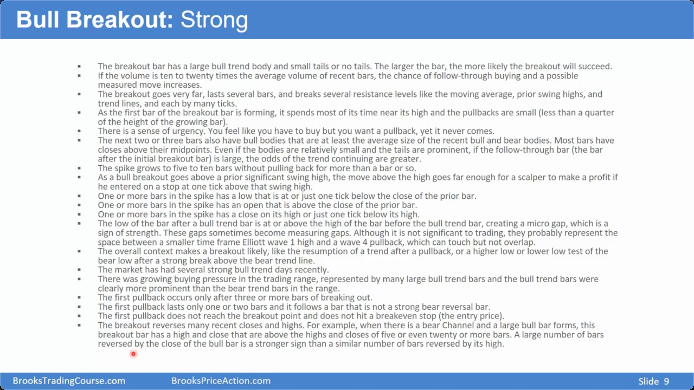
  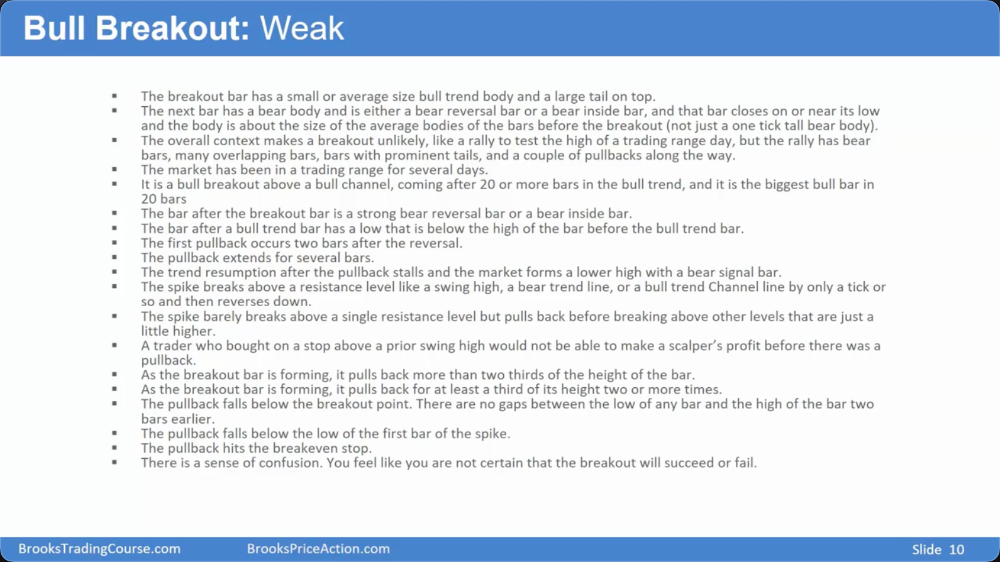

### 弱突破（失败）的信号

- **意外 K 线 (Surprise Bar)**：一根巨大的反向 K 线，完全吞没了之前的突破努力，瞬间套牢了顺势交易者。
- **糟糕的跟随 (Poor Follow-through)**：强劲的突破 K 线之后，紧接着的是一根反向 K 线或无力的十字星，表明动力未能延续。
- **被困的交易者 (Trapped Traders)**：当意外反转发生时，顺势交易者被套牢（Trapped in），而等待回调的逆势交易者则被困在场外（Trapped out），这种合力通常会推动价格继续向反转方向运行。
  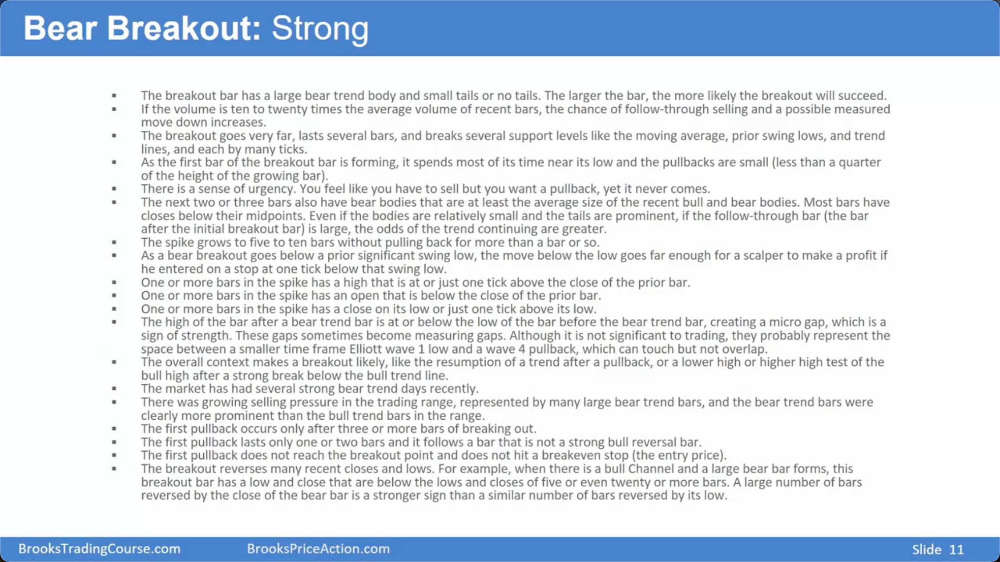
  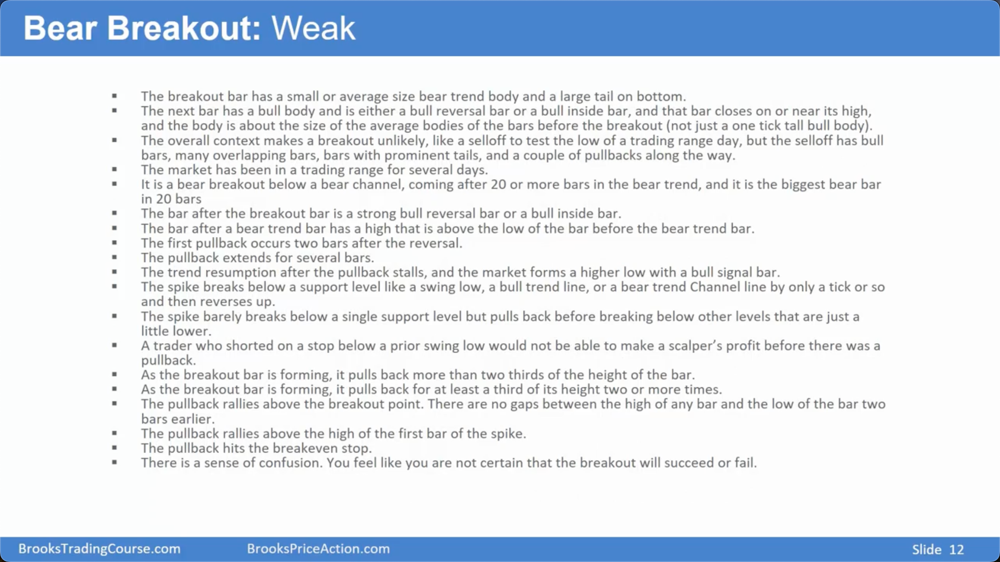

## 强趋势中的交易策略

### 多种入场方式

- **市价单 (Market Order)**：当趋势强度和紧迫性非常明显时，直接以市价入场，追求时效性。
- **收盘价入场 (On Close)**：在强趋势 K 线的收盘瞬间入场。甚至可以在弱小的反向 K 线收盘时入场，押注反转尝试会失败。
- **突破单 (Stop Order)**：在回调 K 线的极点（高点/低点）之外挂单，用于捕捉趋势恢复的瞬间。
- **限价单 (Limit Order)**：在趋势运行过程中，于回调位挂限价单，押注小级别的反转尝试会失败（即买入回调）。
  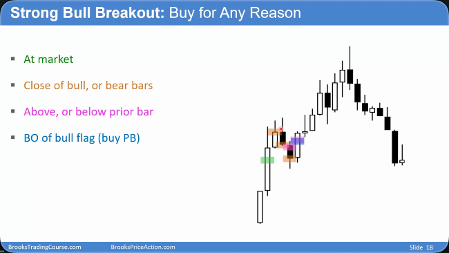
  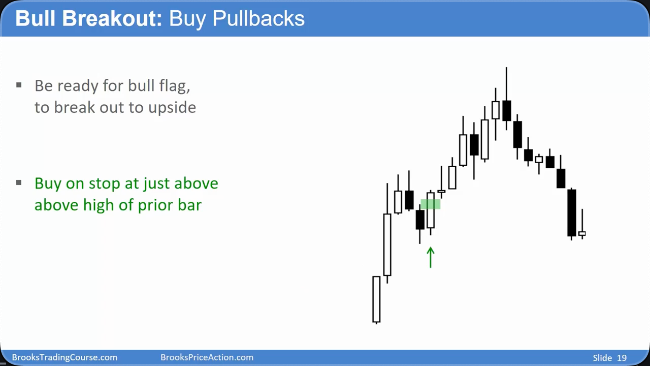
  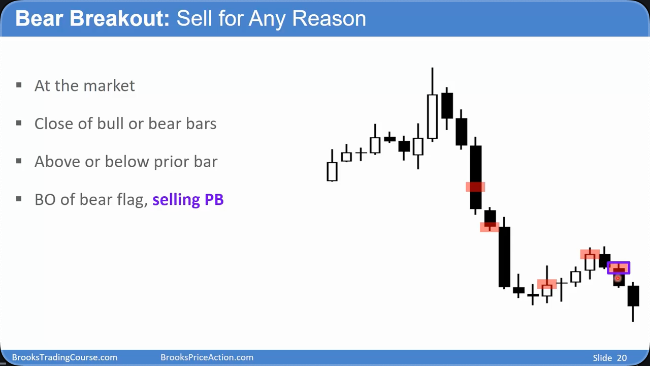
  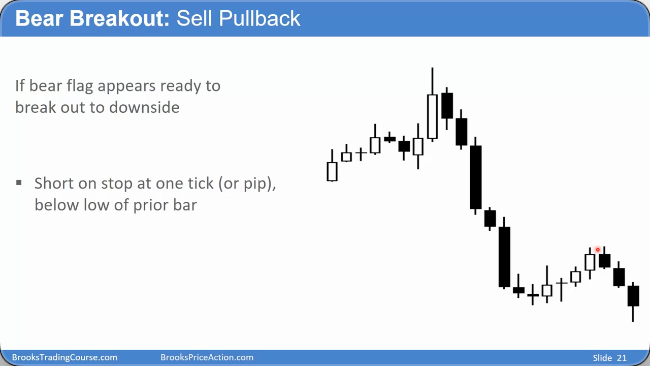
  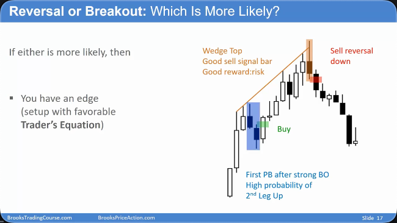

### 核心心态

- **假设趋势延续**：：**在确认的强趋势中，应默认任何回调都只是“旗形”，是入场机会而非离场信号。**
- **时刻准备**：必须积极主动，不断根据新的 K 线调整自己的挂单，时刻为入场做好准备。

## 总结原则

- **警惕第 2 段陷阱**：尤其是在震荡区间中，看似完美的突破往往是陷阱。
- **突破看背景，延续看跟随**：突破的成功率极度依赖于它所处的市场背景，而突破后的跟随 K 线是验证其成败的关键。
- **强趋势中的首次回调是高概率机会**：强劲突破后的第一次回调，大概率会失败，为顺势交易者提供了绝佳的入场点。
- **灵活运用多种入场方式**：根据趋势的强度和紧迫性，灵活选择市价、收盘价、突破单或限价单等方式入场。
