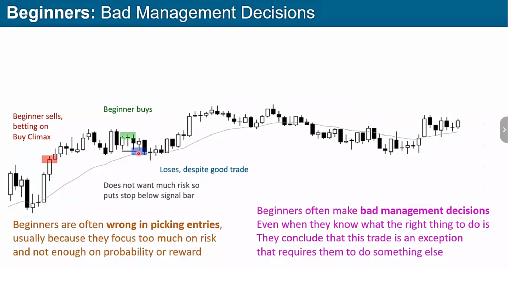

# 因为失误而亏损

## 新手常见误区

### 只关注风险不关注概率

1. 糟糕的止损，只关注风险 而忽略了概率，所以设置了 tight stop
2. 管理波段交易使用 scalp 止损，这样会导致你的盈亏比极差，scalp 需要 80%，90%的胜率
3. 更糟糕的情况就是你 taking profit like scalp trade but stop like swing trade
4. 如果你不能接受正确的止损 那么则不应该开始这笔交易，而不是设置更加糟糕的止损
5. 所以你需要的有一定规模的账户 不会因为正确的止损位置 导致紧张的情绪或者有压力
6. reasonable position / don't care size position/ protect stop / reasonable stop
7. 如果止损太远 则需要使用更小的仓位(趋势后期入场)

### 好的交易管理可以拯救坏一笔的交易，但是需要注意 **position**

### 如果当前交易前提已经失败 则应该立刻离场 get out immediately

### 如果一笔交易的盈亏比很好 那么他的概率很低

### 市场每笔交易都会有机构跟你在做相反的事情，所以你的盈亏比高/那代表对方的胜率高

### 在 tight channel 做 reversal 并进行加仓，导致仓位太大

### 应该 trade in direction

1. 往往在关注风险 而忽略概率就会想去做 reversal
2. 即使良好 reversal 信号 ，概率大概也只有 40%
3. 所以在 tight channel 进行 reversal 并且不断没有合理 scaling in 是灾难
   

### trade in direction 也需要合适的进场

### 哪怕做了一个错误的交易也不愿意 stop

### 依赖合理止损 & 执行

1. 依靠合理 stop 并提前设置好止损的位置 再开始这笔交易 而不是进场后 有一些亏损而感到不安则立即止损
2. 如果交易前提没有改变，则应该依赖止损位置
3. 并要有这笔交易会被止损，止损是否可以接受，如果不能则不应该开始这笔交易

