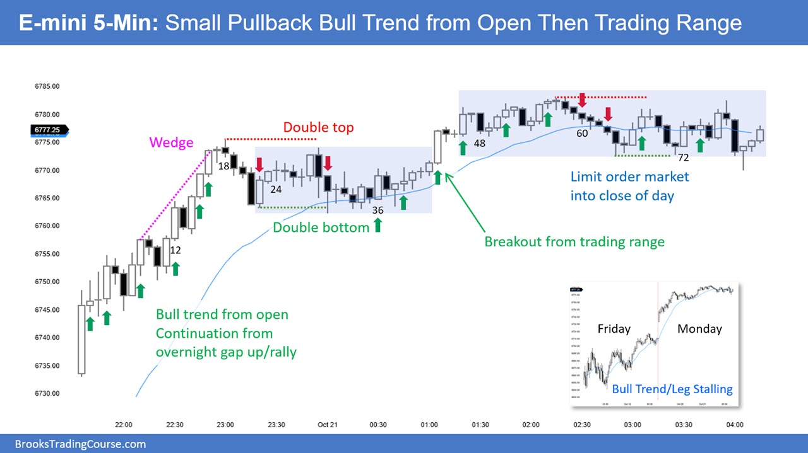
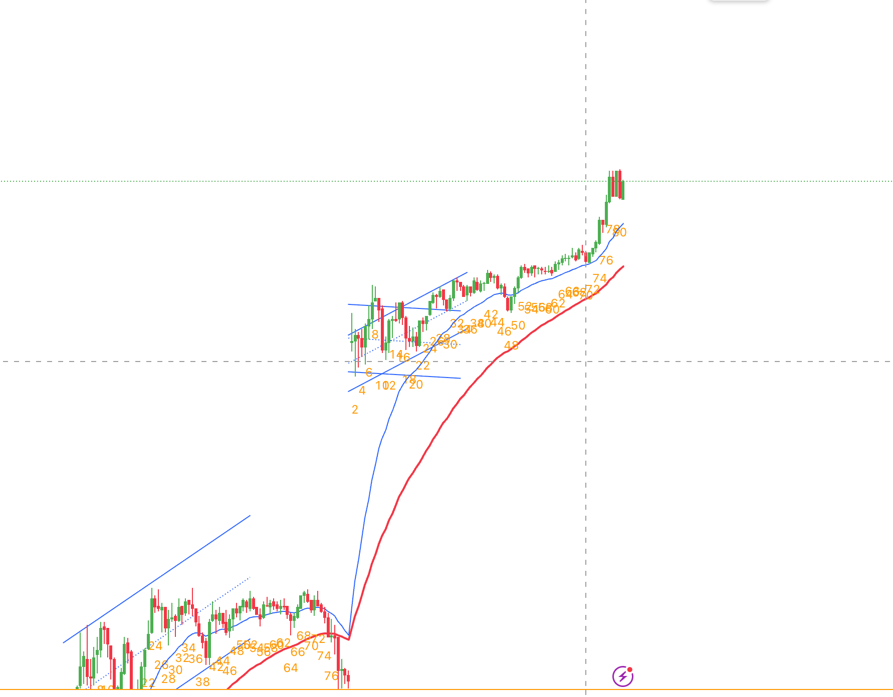
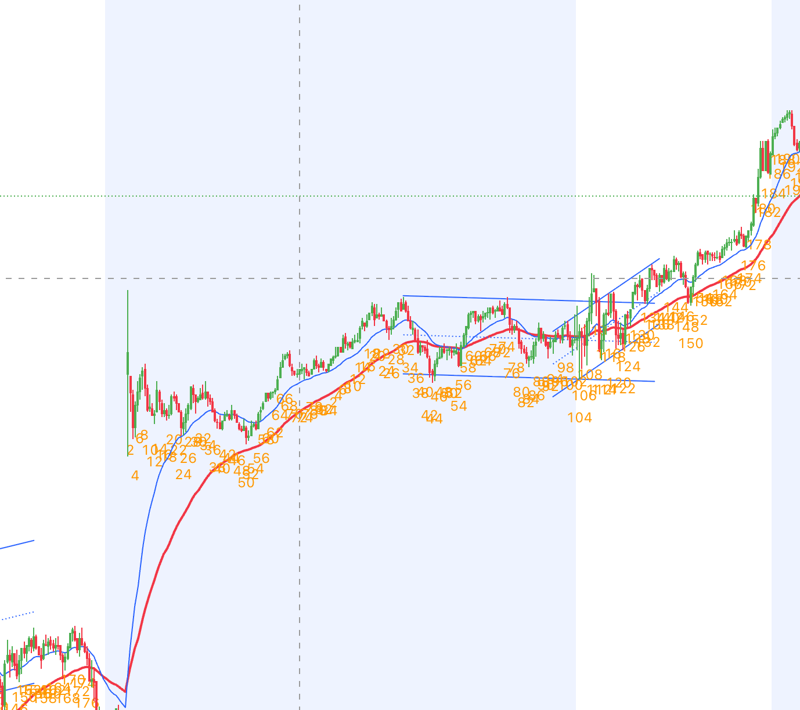

# review

## 2025/10

### E-mini 10.21

### E-mini 10.22

### E-mini 10.27 Monday

- **RTH**: gap up => spike => bull channel **更高的低点**
- **ETH]**: gap up => bull flag => tight bull channel => two legs down => trend resume => broad bull channel => tight bull channel
  
  
- **更高的低点** => **bull channel** => **trade in direction**
- **震荡区间**: 应该减少仓位交易或者最好顺大逆小，比如你在一个 bear channel 但是大的的方向是 bull trend,所以这个 channel 可能 bull trend resume
- **如果有更高的地点则更应该当成 bull channel 来交易 而不是当成 TR**

### E-mini 10.28 Tuesday

## 2025/11

## 2025/12
