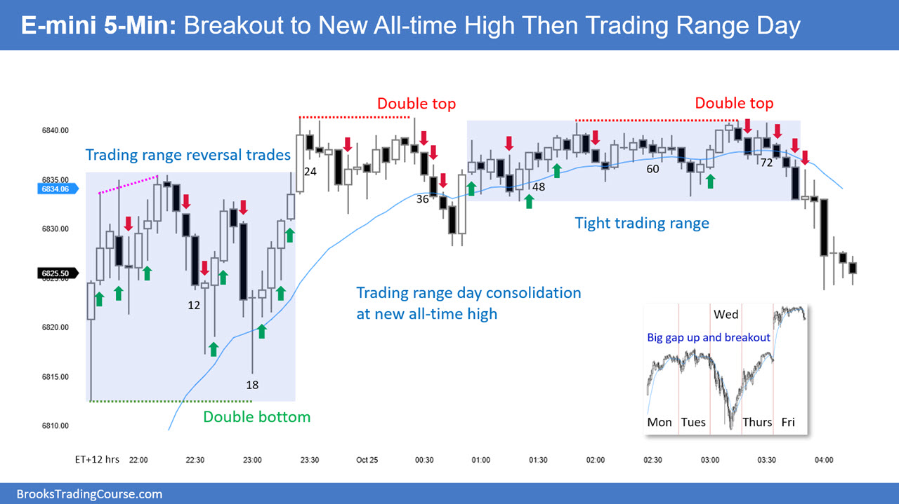

# review

## 2025/10

### E-mini 10.21


### E-mini 10.22

### E-mini 10.24 Friday



### E-mini 10.27 Monday

- **RTH**: gap up => spike => bull channel **更高的低点**
- **ETH]**: gap up => bull flag => tight bull channel => two legs down => trend resume => broad bull channel => tight bull channel
  
  
- **更高的低点** => **bull channel** => **trade in direction**
- **震荡区间**: 应该减少仓位交易或者最好顺大逆小，比如你在一个 bear channel 但是大的的方向是 bull trend,所以这个 channel 可能 bull trend resume
- **如果有更高的地点则更应该当成 bull channel 来交易 而不是当成 TR**

### E-mini 10.28 Tuesday

### E-mini 10.29 Wednesday

### E-mini 10.30 Thursday

### E-mini 10.31 Friday

## 2025/11

### E-mini 11.04 Tuesday

- 怎么判断当前是处于什么趋势
- 我是交易日内 5 分钟 K
- 今天是 gap down 夜盘下降趋势 导致开盘大幅跳空
- 但是开盘 前 15 根 K 是上涨趋势
- 现在市场在下跌 我该判断刚刚开盘 15 分钟的上涨只是夜盘的下降趋势的回调
- 现在市场在下跌是 对夜盘跳空下跌趋势的恢复
- 还是应该判断现在只是对开盘 15 分钟上涨趋势的回调呢
-
- 这是一个非常经典且棘手的日内交易场景！你完美地描述了一个**多时间框架趋势冲突**的典型情况。我们来系统地拆解它。

我们面对的是一个日内交易者，交易 5 分钟 K 线。今天夜盘是下降趋势，导致开盘大幅跳空（gap down）。开盘前 15 根 K 线（即开盘后 75 分钟）是上涨趋势，但现在市场在下跌。我们需要判断当前下跌是夜盘下降趋势的恢复，还是对开盘上涨趋势的回调。

判断趋势时，我们需要考虑多个时间框架和背景。以下是一个分析框架：

大背景：夜盘是下降趋势，且开盘跳空低开（gap down）。这意味着大周期（比如 30 分钟或 1 小时）可能处于下降趋势中。

开盘后的上涨：开盘后前 15 根 5 分钟 K 线上涨，这可以看作是对夜盘下跌的反弹（回调）。但需要注意的是，如果这个反弹很强，可能会改变短期趋势。

当前市场在下跌：现在我们需要判断这个下跌是继续夜盘的下降趋势（即反弹结束，恢复下跌）还是只是对开盘上涨的回调（即回调后还会继续上涨）。

如何判断？

我们可以使用以下方法：

观察价格是否突破了关键水平（如夜盘的低点、开盘的高点等）。

使用趋势线、均线或其他工具来确认趋势。

具体步骤：

a. <span style="color: red;"> 确定夜盘下降趋势的关键水平：比如夜盘的低点，以及下跌过程中的反弹高点。</span>

b. <span style="color: red;">观察开盘后的上涨：这波上涨是否突破了夜盘的某个关键阻力？比如，是否突破了夜盘下跌的最后一个波段高点？如果没有，那么说明夜盘的下降趋势可能仍然完好，当前的下跌只是反弹结束后的恢复下跌。</span>

c. <span style="color: red;">观察当前下跌的力度：如果当前下跌已经跌破了开盘上涨的起点（即跳空后的低点），那么很可能是在恢复夜盘的下跌趋势。如果没有跌破，则可能只是对开盘上涨的回调。</span>

d. <span style="color: red;">使用 EMA20 均线：如果价格在均线下方，且均线方向向下，那么趋势可能仍然是向下的。</span>

但是，由于你交易的是 5 分钟 K 线，那么更小周期的趋势（比如 1 分钟）可能会更敏感，但我们也要注意不要过度关注噪音。

综合判断：

由于夜盘是下降趋势，且开盘跳空，这给了市场一个强烈的空头信号。开盘后的上涨可能只是对跳空的技术性修正（回补缺口的一部分）。如果这个上涨没有突破夜盘的关键阻力（比如夜盘下跌的 50%回撤位或者某个波段高点），那么市场很可能恢复下跌。

如果当前下跌已经跌破了开盘后的起涨点，那么几乎可以确认下跌趋势恢复。如果当前下跌在开盘后的起涨点之上获得支撑，那么可能只是回调，之后可能会继续上涨（但上涨空间可能受限，因为大背景是下跌）。

因此，建议：

画出夜盘下跌的斐波那契回撤位（从夜盘高点到跳空低点），观察开盘后的上涨在哪个回撤位（如 38.2%, 50%, 61.8%）受阻。

标记开盘后的起涨点（即跳空后的最低点）和上涨的高点。如果当前下跌跌破起涨点，则恢复下跌趋势的概率大；如果在前述斐波那契支撑位（如 50%或 61.8%）止跌，则可能只是回调，之后会继续上涨。

注意：在跳空背景下，通常会有回补缺口的倾向，但并不意味着一定会回补。如果回补缺口的动力不足（即开盘后的上涨未能回补缺口），那么市场很可能继续下跌。

最终，我们需要根据价格行为来确认。例如，如果当前下跌出现了一系列更低的高点和低点，那么下降趋势可能已经恢复。

由于你是在交易 5 分钟 K 线，所以你的交易决策应该基于 5 分钟图上的价格行为，但也要参考更大周期（如 15 分钟或 30 分钟）的趋势。

总结：

在当前情况下，更有可能的是：开盘后的上涨是对夜盘下跌的回调，当前下跌是恢复夜盘的下降趋势。除非开盘后的上涨非常强劲（比如大幅回补缺口甚至收盘在缺口之上），否则我们应倾向于认为主要趋势是下跌。

但是，具体操作还需要结合你的交易系统，比如：

如果价格跌破开盘后的起涨点，你可以考虑做空，止损设在开盘上涨的高点上方。

如果价格在起涨点之上获得支撑并出现看涨信号，你可以考虑做多，但目标不宜过大，因为大趋势是向下的。

请注意风险控制，尤其是在跳空后的震荡中。

### 🎯 核心判断框架：谁是“老板”？

在这种冲突中，我们需要建立一个**层级判断系统**：

1.  **更高时间框架趋势 = 大老板**（决定长期方向）
2.  **日内主要趋势 = 部门经理**（决定当天基调）
3.  **短期微型趋势 = 员工**（随时可能变化）

在你的场景中：

- **大老板**：夜盘建立的**下降趋势** + **Gap Down**（这是最重要的背景）
- **部门经理**：开盘前 15 分钟的**上涨趋势**
- **员工**：当前这波**下跌**

### 📊 如何决策：概率的天平倾向哪边？

根据经验法则，**在重要跳空（Gap Down）之后，市场的第一次反向运动（你的前 15 分钟上涨），有极高概率仅仅是对跳空的“回补”或“技术性反弹”，而非趋势反转。**

以下是你的决策流程图，它清晰地展示了如何分析并应对这种复杂局面：

```mermaid
flowchart TD
    A[“初始状态: <br>夜盘Gap Down下降趋势”] --> B[“开盘出现<br>前15分钟上涨”]
    B --> C{“关键判断<br>上涨是否突破<br>夜盘关键阻力位?”}

    C -- 否 --> D[“结论: 这是技术性回调<br>主趋势(下跌)未变”]
    C -- 是 --> E[“结论: 可能趋势反转<br>需进一步确认”]

    D --> F[“交易计划: <br>寻找反弹做空机会”]
    E --> G[“交易计划: <br>等待回踩做多机会”]

    F & G --> H[“等待价格行为<br>确认信号入场”]
```


### 💡 关键的交易思维转变

从这个分析中，你需要汲取的核心经验是：

- **不要被短期的“逆流”迷惑**：永远先从最大的时间框架和最显著的市场事件（如跳空）开始分析。
- **等待市场证明自己**：在前 15 分钟上涨时，你不需要去猜它是回调还是反转。你只需要问：“它**突破**了证明下跌趋势无效的关键位置了吗？”如果没有，那么就**维持原趋势思路**。
- **耐心是你的武器**：在冲突行情中，最好的交易通常是**等待一方明显胜出后**再入场，而不是在双方激战正酣时冲进去。

**记住：你的目标不是抓住第一个波动，而是抓住最确定、盈亏比最優的那一个波动。** 在这种场景下，顺应“大老板”的方向，在“部门经理”的反弹乏力时入场，才是概率上最明智的选择。

## 2025/12
