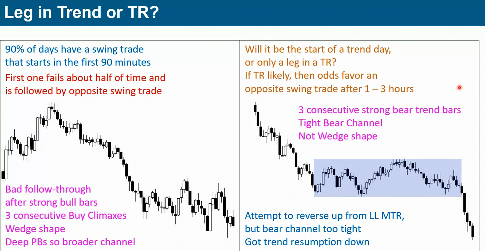
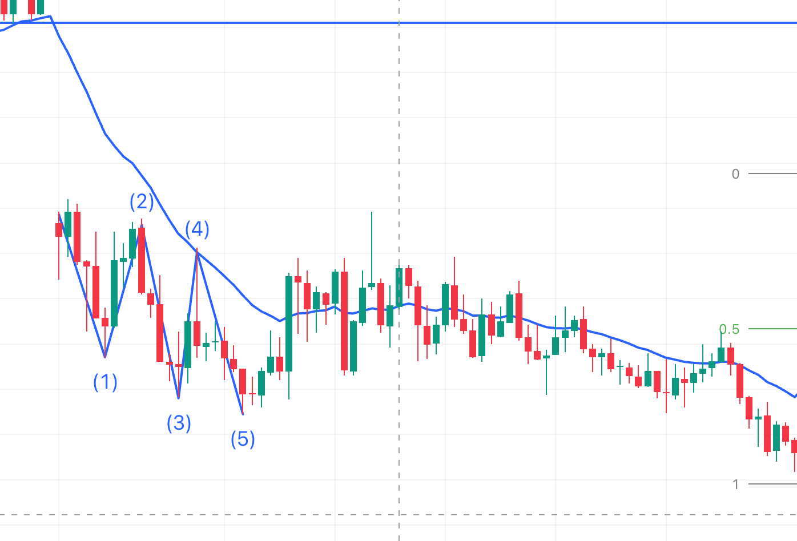
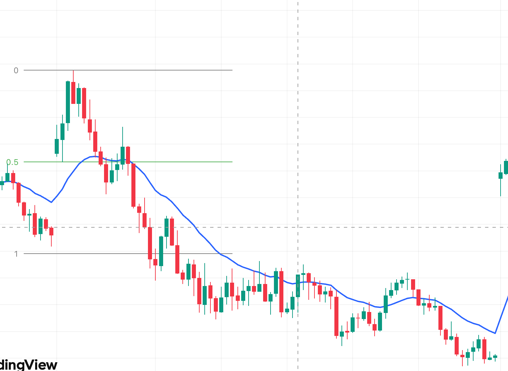
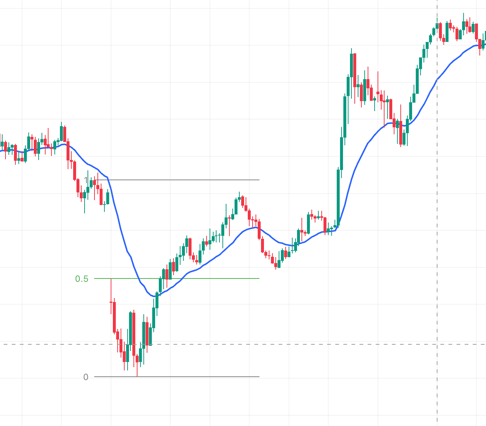
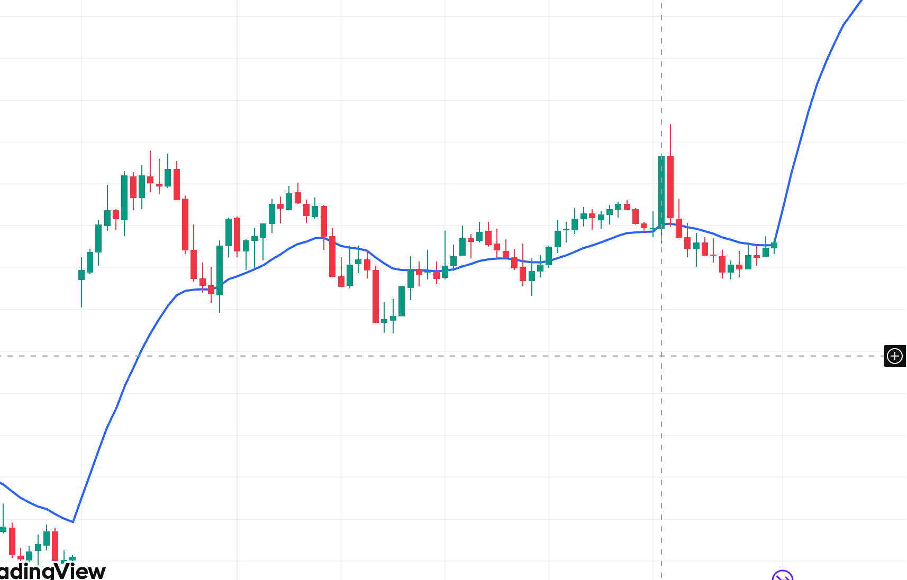
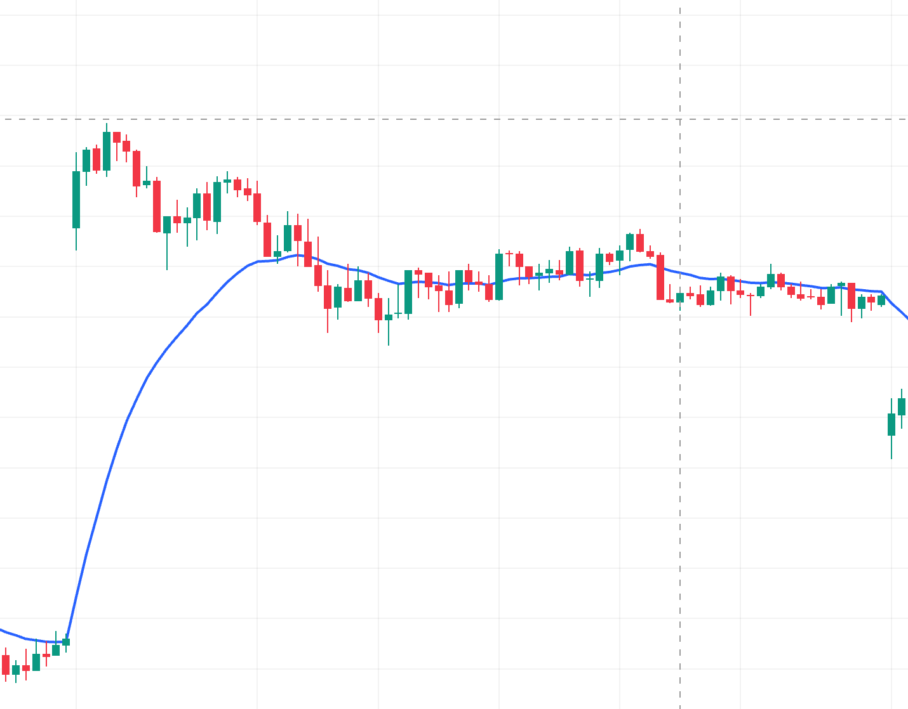
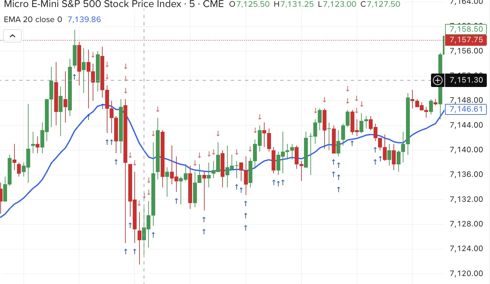
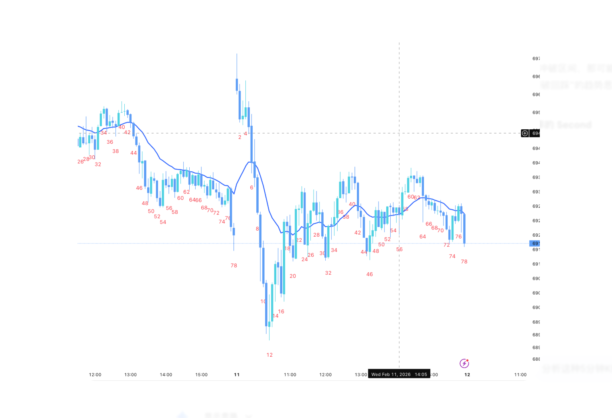

# 趋势专题

## 1. 为什么宽通道大概率会反向突破

- 核心原因：宽通道里逆势交易者经常能赚钱，说明原趋势已经不够“健康”。
- 强趋势不该让逆势方轻松获利；一旦逆势反复成功，市场就更接近平衡而非单边。
- 当顺势方无法持续打出“干净推进段”，趋势线被反向突破的概率就会升高。

## 2. 信号 K 与 Stop Order 进场

- 原则：`signal bar + stop order` 是最小程度的顺势交易，属于突破交易逻辑。
- 做顺势单时，不要过度纠结信号 K 稍大，重点看背景是否支持继续。
- 真正要警惕的是逆势那一侧出现的大信号 K，因为它代表你在对抗主导方向。

### 2.1 好的信号 K 是什么

- 好信号 K 不是“形状漂亮”，而是“在对的位置表达清晰意图”。
- 位置：出现在关键位（回调位、区间边缘、突破回踩位、`EMA20` 结构位）。
- 收盘：实体朝交易方向，最好收在本根极值附近。
- 拒绝：做多看下影拒绝，做空看上影拒绝。
- 一致：信号方向与左侧 `context` 一致，顺势优先。
- 可做：触发位到止损位的 `R` 结构合理，数学期望可接受。
- 一句话：`好信号 K = 好位置 + 好收盘 + 好背景 + 好盈亏结构`。

## 3. Gap Day 处理框架

- 常见路径：开盘跳空后，价格经常先测试 `EMA20`，再决定当日主方向。
- 关键点：测试 `EMA20` 本身不等于必涨或必跌，也可能进入震荡。
- 实战上先判断“测试后的跟随”：
  - 有强跟随：按顺势处理。
  - 跟随弱、重叠增多：按震荡处理。

## 4. 三推楔形 + 信号 K

- 三推楔形是衰竭结构，不是“看到就立刻反转”，仍要等信号 K 确认。
- 结构 + 信号合并后再进场，胜率显著高于只看形态猜顶猜底。
- 不要害怕顺势方向上的大信号 K；若要谨慎，更应对逆势信号 K 保守。

## 5. Second Entry（第二次进场）

- 一次回调失败后，二次尝试（Second Entry）通常更可靠。
- 第二次进场本质：等待市场证明“第一次逆势尝试失败”，再顺主方向入场。
- 可配合：
  - `HL/HH`（多头）或 `LH/LL`（空头）结构；
  - 信号 K 突破触发；
  - `EMA20` 附近的恢复动作。

## 6. 健康趋势检查清单

### 6.1 EMA

- `EMA` 斜率明显（陡峭）。
- 价格与 `EMA` 存在趋势缺口（EMA Gap），而不是反复黏连。

### 6.2 高低点结构

- 多头：`HL/HH` 持续。
- 空头：`LH/LL` 持续。
- 关键位置有 Gap 或明确破位，而非来回假突破。

### 6.3 波段质量

- 推进段（Leg）干净利落。
- 更理想：`leg gap` 多于 `leg overlap`。
- 若推进段频繁重叠，趋势质量下降。

### 6.4 回调质量

- 回调浅（常见不超过 50%，强趋势常在 30% 左右或更浅）。
- 回调后能快速恢复主方向。
- 回调中不出现大量重叠与反复拉扯。

### leg or trend



## 7. 左侧 Context 的范围（怎么界定）

- `Context` 不是固定根数，而是会改变当前这笔交易胜率的最小充分左侧信息。
- 建议按四层看：
- 近端（最近 10-30 根）：重叠、动能、follow-through、与 `EMA20` 的关系。
- 结构（最近 1-3 个波段）：`HH/HL` 或 `LL/LH` 是否连续。
- 日内（开盘到现在）：趋势日/震荡日/突破模式日，是否有 gap 与磁铁位。
- 高周期（上一级周期）：前高前低、区间边界、通道线、测量目标位。
- 执行标准：如果左侧不能回答“为什么现在做、为什么在这里做”，就不下单。

## 8. 一句话执行标准

- `EMA 仍陡峭 + 推进段干净 + 回调浅 + 重叠少`：优先顺势。
- `EMA 走平 + 重叠增多 + 逆势反复赚钱`：警惕宽通道反向突破，切换震荡/反转思维。

## 9. 盘中 30 秒检查清单

### 9.1 Context 检查（30 秒）

- 市场状态是否清晰（趋势/震荡/转换）？
- 当前位置是否是关键位（边缘/回踩/突破测试）？
- 左侧结构是否连续（`HH/HL` 或 `LL/LH`）？
- 当前推进段是否有跟随，而非高重叠？
- 上一级周期是否没有明显反向压制？

### 9.2 信号 K 检查（30 秒）

- 信号 K 是否出现在关键位置？
- 收盘是否靠近交易方向极值？
- 是否存在有效拒绝（下影/上影）？
- 触发价与止损位是否清晰？
- `R` 结构是否可接受（不是追差价）？

### 9.3 一票否决（任一命中就不做）

- 在区间中间追单。
- 信号与 `context` 反向，且没有强跟随确认。
- 不能一句话说明“为什么在这里做这笔单”。

# MES 日内交易Model v2.0

## 第一部分:开盘前准备(开盘前10分钟,必须做)

**1. 看高周期context**

- 打开**日线图**:当前在什么位置?(前高附近? 前低附近? 区间中间?)
- 打开**1小时图**:过去3天的Always In方向?
- 打开**15分钟图**:今天隔夜段形成了什么结构?

**2. 标出关键价位**

- 前一日 High / Low / Close
- 隔夜段 High / Low
- 当日 Pivot Points(可选)
- 你能看到的**最明显的swing high/low**

**3. 写下今日Bias(一句话)**

格式:**"今天我倾向于\_**\_方向,除非价格突破\_\_**价位"**

例子:"今天我倾向于Long,除非价格跌破昨日低点6800"

**这个bias会过滤掉你80%的逆势冲动**。

---

## 第二部分:Context判断(开盘后前6根5分钟K线)

### 量化的Context判断标准

不要凭感觉。用以下**硬性量化标准**:

**判断Trend还是TR:看前6根5分钟K线(即开盘后30分钟)**

| 特征              | Trend                                   | TR                         |
| ----------------- | --------------------------------------- | -------------------------- |
| EMA斜率           | 前6根bar的EMA首尾差 > 价格平均波幅的50% | EMA几乎走平                |
| Bar overlap       | <40%的bar和前一根有overlap              | >60%的bar和前一根有overlap |
| HH/HL 或 LL/LH    | 明确形成                                | 高低点混乱                 |
| Strong trend bars | ≥2根,且方向一致                         | <2根或方向混乱             |

**三项中满足两项 → 对应context**

**如果判断不出来(3项各持半) → 默认TR,不交易第一个小时**

---

### Context细分(参照Brooks Tree)

**如果是Trend,进一步判断Breakout还是Channel:**

- **Strong Breakout**:连续3根以上大实体trend bars,回调极浅(<40% retrace)
- **Weak Breakout**:趋势成立但bars有mixed,一些doji
- **Tight Channel**:趋势方向明确,但每根bar间重叠较多,进展慢
- **Broad Channel**:趋势方向有,但回调深,常触及EMA

**如果是TR,进一步判断:**

- **Tight TR**:区间<每日ATR的30%
- **Broad TR**:区间>每日ATR的50%,且有明显上下边界

---

## 第三部分:Strategy Selection(根据Context自动选策略)

**这是核心优化**:不同context用不同策略,不再"一把梭EMA pullback"。

| Context         | 策略                        | Setup类型        | 进场方式                           |
| --------------- | --------------------------- | ---------------- | ---------------------------------- |
| Strong Breakout | **BTC/STC**                 | 追突破           | Market on close of strong bar      |
| Weak Breakout   | **Enter on PB**             | First pullback   | Stop entry above/below signal bar  |
| Tight Channel   | **Trade in Dir of BO**      | 只做突破方向     | Stop entry in breakout direction   |
| Broad Channel   | **BLSHS Sloped**            | 高抛低吸(偏顺势) | Limit orders at channel boundaries |
| Tight TR        | **W4BO(Wait For Breakout)** | **不交易**       | 只观察,等破位                      |
| Broad TR        | **BLSHS**                   | 区间高抛低吸     | Limit orders at TR boundaries      |

**关键规则**:

- **Tight TR直接不交易**。这是你减少亏损的最大杠杆。
- **每种context只用对应的setup**,不混用。

---

## 第四部分:进场决策流程(每个potential setup的30秒checklist)

盘中每次想进场,**必须按顺序跑完以下7个问题**。任何一个"否"→放弃。

**必须按顺序问,不允许跳过:**

1. **Always In方向是?** (Long/Short)
2. **我要做的方向和Always In一致吗?**(不一致→跳过,除非A+ reversal)
3. **当前Context是什么?**(6种之一,说不出来→Tight TR→不做)
4. **这个context对应的策略是什么?我现在要做的是这个策略吗?**
5. **Signal bar质量?**(trend bar? close在极值附近? 实体饱满?)
6. **止损位具体价格?盈亏比≥2:1?**
7. **如果止损被触发,我会加仓吗?**(会→不做)

**关键:把这7个问题打印出来贴在屏幕旁。每次下单前指着纸念一遍。**

---

## 第五部分:A+ Setup的硬性定义(不达到就不是A+)

**必须同时满足以下5项才叫A+:**

1. **Context明确**(Strong Breakout / Weak Breakout first pullback / Failed Breakout)
2. **Always In方向 = 进场方向**
3. **Signal bar = strong trend bar**(实体占bar range≥70%,close在极值20%以内)
4. **进场位置有结构意义**(EMA + 前期支撑/阻力 + swing point的至少2个重合)
5. **盈亏比≥3:1**

**满足5/5 → A+,正常仓位**
**满足4/5 → A,正常仓位的60%**
**满足3/5 → B,不做**(新手硬性规则)

---

## 第六部分:仓位与风险管理

**MES基础规则**(假设账户$10,000,按1%风险):

- 单笔风险 = $100
- MES每tick = $1.25
- 最大止损距离 = 80 ticks = 20 points
- **实际操作中,止损通常8-15 points,所以仓位可以是2-3手MES**

**仓位公式**:

```
手数 = min(账户×1% / (止损points × $5), 3手)
```

**加仓规则(严格)**:

- 只有盈利 + 新的独立setup → 才允许加仓
- **任何情况下,亏损单不允许加仓**(这是你的个人硬规则)

---

## 第七部分:出场规则

**三种出场方式,任何一个触发即出:**

1. **止损触发**:按进场时设定的止损,不移动(除非已盈利≥1R后可以移到保本)
2. **目标达到**:RR 2:1处减仓50%,剩余用trailing stop
3. **Context改变**:如果Always In flip → 立即平仓,不等止损

**Trailing Stop方法**:

- 每形成一个新的HL(多单)/LH(空单),止损就跟上去
- 或每根strong trend bar收盘后,止损移到前一根bar的极值

---

## 第八部分:个人弱点防护机制(为你量身定制)

根据你的具体问题,设立以下**硬性规则**:

**规则A:EMA斜率保护**

> **EMA20向上 → 全天禁止做空**
> **EMA20向下 → 全天禁止做多**
>
> 例外:只有在出现明确的Always In flip(strong opposite bar + swing point突破)后,才允许反向。

**规则B:盈利后强制冷静期**

> 单笔盈利≥2R后,**强制停止交易30分钟**。
> 目的:防止"赚钱后继续追"的亢奋决策。

**规则C:连续亏损熔断**

> 当日累计亏损≥2R → 停止交易,收盘后复盘。
> 目的:防止"翻本心态"导致的加仓和逆势。

**规则D:禁止加仓亏损单(最重要)**

> 任何情况下,亏损中的仓位禁止加仓。
> 如果你发现自己想加仓摊平 → **立即平仓,离开电脑15分钟**。

**规则E:逆势冲动识别**

> 如果你发现自己在想:
>
> - "涨太多了,该回调了"
> - "跌这么多,该反弹了"
> - "这个价位是阻力/支撑,应该反转"
>
> → **这是逆势冲动,直接放弃这笔交易**。
> Brooks原则:**Price goes where price wants to go. Your opinion doesn't matter.**

---

## 第九部分:日内时段规则(MES特有)

MES日内不同时段有不同特性,要区别对待:

| 时段(美东时间) | 特点                  | 策略                         |
| -------------- | --------------------- | ---------------------------- |
| 9:30-10:00     | 开盘高波动,容易假突破 | **观察,不急进场**            |
| 10:00-11:30    | 趋势最清晰            | **主要交易时段,只做A+**      |
| 11:30-13:30    | 午休,流动性差         | **减少交易,容易被洗**        |
| 13:30-15:00    | 趋势重启 or 延续      | **次要交易时段**             |
| 15:00-16:00    | 收盘前波动大          | **除非有明确setup,否则不做** |

**核心时段:10:00-11:30,集中精力做这段。**

---

## 第十部分:盘后复盘(每天必做,30-60分钟)

1. **今天Context判断正确吗?** 如果错了,错在哪?
2. **每笔交易对照7问checklist,有没有跳过问题?**
3. **有没有出现"逆势冲动"或"加仓冲动"?** 记录下来。
4. **今天最好的setup是什么?** 如果错过,为什么?
5. **Bar-by-bar journal关键时刻**(至少标注Always In flip的位置)

---

## 第十一部分:每日开盘前5秒钟自问

开盘前,对着镜子/屏幕说三遍:

> **"我今天不预测市场,只反应市场。"**
> **"EMA向上,我不做空。EMA向下,我不做多。"**
> **"亏损单绝不加仓。"**

这不是玄学。**强制的自我宣告能在潜意识里建立行为约束**,Brooks自己在视频里也提到过类似的日常仪式。

---

## 一张纸的Model总结(打印贴在屏幕旁)

```
┌─────────────────────────────────────────┐
│         MES DAILY TRADING MODEL         │
├─────────────────────────────────────────┤
│ 1. OPEN CONTEXT (6 bars):               │
│    Trend or TR? Strong/Weak/Tight/Broad │
│                                         │
│ 2. STRATEGY by CONTEXT:                 │
│    Strong BO  → BTC/STC                 │
│    Weak BO    → Enter on PB             │
│    Tight Ch   → Dir of BO               │
│    Broad Ch   → BLSHS Sloped            │
│    Tight TR   → ❌ NO TRADE             │
│    Broad TR   → BLSHS                   │
│                                         │
│ 3. 7-QUESTION CHECKLIST:                │
│    □ Always In direction?               │
│    □ My direction matches AI?           │
│    □ Context is clear?                  │
│    □ Strategy matches context?          │
│    □ Signal bar quality (≥70% body)?    │
│    □ RR ≥ 2:1?                          │
│    □ Won't add to loser?                │
│                                         │
│ 4. HARD RULES:                          │
│    ❌ EMA↑ → No shorts                  │
│    ❌ EMA↓ → No longs                   │
│    ❌ Never add to losing position      │
│    ⏸ +2R → 30min break                  │
│    🛑 -2R day → STOP                    │
│                                         │
│ 5. BEST WINDOW: 10:00-11:30 EST         │
└─────────────────────────────────────────┘
```

---

**与原model相比的核心升级**

1. **Context判断有量化标准**(不再凭感觉)
2. **6种context对应6种策略**(不再一把梭EMA pullback)
3. **7问checklist是决策树,不是清单**(盘中30秒可跑完)
4. **A+有硬性5项定义**(不再主观)
5. **针对你个人弱点的硬性规则**(EMA方向保护、加仓禁令、熔断)
6. **时段规则**(集中火力在10:00-11:30)
7. **Brooks Context Tree完整整合**(和你看的Al Brooks体系一致)

---

**最后给你的建议**

这个model看起来复杂,但盘中真正要执行的就是:

1. **开盘前写bias**(2分钟)
2. **开盘后30分钟判断context**(不交易)
3. **根据context选策略**(1种)
4. **等A+ setup出现**(可能等1-2小时)
5. **跑7问checklist**(30秒)
6. **进场、设止损、等出场信号**
7. **+2R休息 或 -2R停止**

**一天的"黄金setup"通常只有1-3个。** 如果你发现自己一天做了5笔以上,99%是在过度交易,违反了model。

---

要不要我帮你把这个model做成一个**实际的一页纸PDF/打印版**,或者设计一个**每日复盘模板**?另外,你现在账户大小、日内可承受的回撤、每天能全神贯注交易的时长是多少?根据这些参数我可以把仓位规则调到你的具体情况。

## 开盘场景

### 开盘 open gap 3推楔形



### 如果趋势不强被反转有概率走的很远，如果趋势很强被反转大概率是TR或者pullback

### open reversal & breakout mode

开盘reversal，因为开盘的趋势不是很强，突破开盘区间并达到MM




### open reversal

开盘reversal，但是因为是big gap开盘，大突破开盘，所以大概率形成TR，



# 规则

- 禁止亏损加仓
- context【15-20根k】 > signal （越强的趋势，惯性越大，越需要second entry， 和follow ）
- breakout need follow (success / fail)
- 不同时间周期
- 小仓位验证方向：市场认可你（盈利），然后再慢慢增加仓位，而不是在市场给你警告（亏损）的时候，你还是继续错误的方向
- protect stop 【一旦确认protect stop 就不可以移动， 这个stop 意味着你能承受的最大loss，但不一定会被触发】
- premise 【如果一旦premise 不成立 则需要直接离场，不一定要等待protect stop 触发】
- maxLoss：1% = `200刀【1mes： 5 * 40 】【2mes： 5 * 2 * 20】 【4mes： 5 * 4 * 10】`
- Review

## 交易规则

### 开盘context（前6-12根k 不进行交易除非有特别好的趋势）

### context判断：

- `EMA 仍陡峭 + 推进段干净 + 回调浅 + 重叠少`：优先顺势。
- `EMA 走平 + 重叠增多 + 逆势反复赚钱`：警惕宽通道反向突破，切换震荡/反转思维。

### 顺势交易

- 顺势市场惯性交易，逆势交易需要更多的支持【3推/重叠/ema走平/deep pullback】

- 逆势也不代表会反转，如果前面的趋势过于强势，可能反转就是形成TR，那么反转交易就是低概率+没有很高的盈亏比的游戏

### 模型1：趋势回调（核心）

条件：

- EMA20 向上/向下
- 连续 HH/HL 或 LL/LH
- 回踩 EMA

入场：

👉 H1 / H2

止损：

👉 信号棒另一侧

### 模型2：Breakout Pullback（突破回踩）

条件：

- 明确区间
- 强突破（大阳/大阴）
  入场：

👉 第一次回踩

### 模型3：Opening Range Breakout（开盘）

条件：

- 前30分钟形成区间

入场：

👉 突破 + 回踩

### 仓位规则

- 不进行亏损加仓
- 斩掉亏损仓 & 扩大盈利仓
- 初始仓位为2mes 最大仓位为4mes
- 亏损一笔 → 强制休息 10–15 分钟 -> 仓位变为1mes
- 单笔交易maxLoss：1% = `200刀【1mes： 5 * 40 】【2mes： 5 * 2 * 20】 【4mes： 5 * 4 * 10】`

### 停止交易

- 连续2笔亏损 → 停止当天交易
- 当日亏损 ≥ 2R → 停止交易
- 当日盈利达到2R => 停止当天交易

### 不要低估长期复利 不要高估短期收益 欲速不达

### 不要让自己变成赌徒 你还有很重要人和事要去完成

### 如果一天10个点， 1手mes10x5=50刀，一个月20天，就是50 x 20 = 1000刀 = 6800RMB

- `target = $100/day 1ms: 5 *【 20pt】 ||  2mes: 2 * 5 * 10pt === month = 2000刀`
- `target = $200/day 2mes: 2 * 5 * 【20pt】 || 4mes: 4 * 5 * 10pt month = 4000刀`

### 市场不会因为你，而进行任何改变

### 你如果不跟随市场，只会被市场无情淘汰

### review

- 记录 setup 并进行分类，总结出那种setup胜率最高，最适合自己
- 记录最差的setup来进行避免

## Apr 20 Monday review

### 整体review:



- 开盘BO但是ETH已经走了很远了，所以立即被Reversal了，fail BO, 然后反向BO 达到MM
- BO一定要等待follow through 等待BO1/BO2/BO3
- 这个failed BO事后看起来可能也有迹可循，因为ETH open gap 然后一直拉到RTH，这个BO，可能是exhaustion gap，并立即被回补
- 后面发生Bear BO,虽然这个Bear BO Bar足够大，也有跟随，但是这个BO是没有收在50%下，说明下面有买盘，并且follow BO1 BO2 BO3 都是inside Bar，并且实体越来越来越小，tail越来越多
- 后面这个Bear BO 虽然成功了，但是也不是非常的强势，所以后面被反转或者今天是大的区间日可能性增加，而不是AIS（always in short）
- 后面Big up,增加的TR Day的概率，后面就一直围绕EMA，来回cross，直到尾盘big reversal
- 宽通道应该大概率被反向反转，但是今天是顺着宽通道的方向突破，所以尾盘尽量避免持仓

### 问题review:

1. BO没有等待跟随就直接进入了
2. BO是发生在ETH的趋势后期是exhaustion gap
3. 发生Bear BO，也不代表全天就是AIS，不能对市场有先入为主的看法，不做预测，只做跟随
4. 后面的宽通道就快速scalp就行，不要想着swing，因为随时可能被BO
5. Tading MORE !== MORE Profit
6. BO的质量
7. BO的 follow质量: BO1 BO2 BO3（是否是假突破case1，是否强势突破case2）

对比sell climax


## Apr 21

### 重大问题

1. 逆势的仓位重 顺势仓位轻 一定一定一定要改动，每次抄底的时候一堆仓位，TMD，抄底死了巨亏，赢了也没JB仓位了，卧槽了DJ
2. 一定要明确止损点，亏损的时候，止损点不够明确，导致一直扛着亏损，所有逆势最好等待明确的信号才进行这样才有明确的止损点，不要害怕止损，止损完，市场如果有合适的机会还可以继续进场
3. 让利润奔跑，虽然有时候会回撤，甚至从盈利到小亏，但是偶尔可以拿到非常大的波段,这就需要一个是仓位要足够多，后续慢慢的take profit
