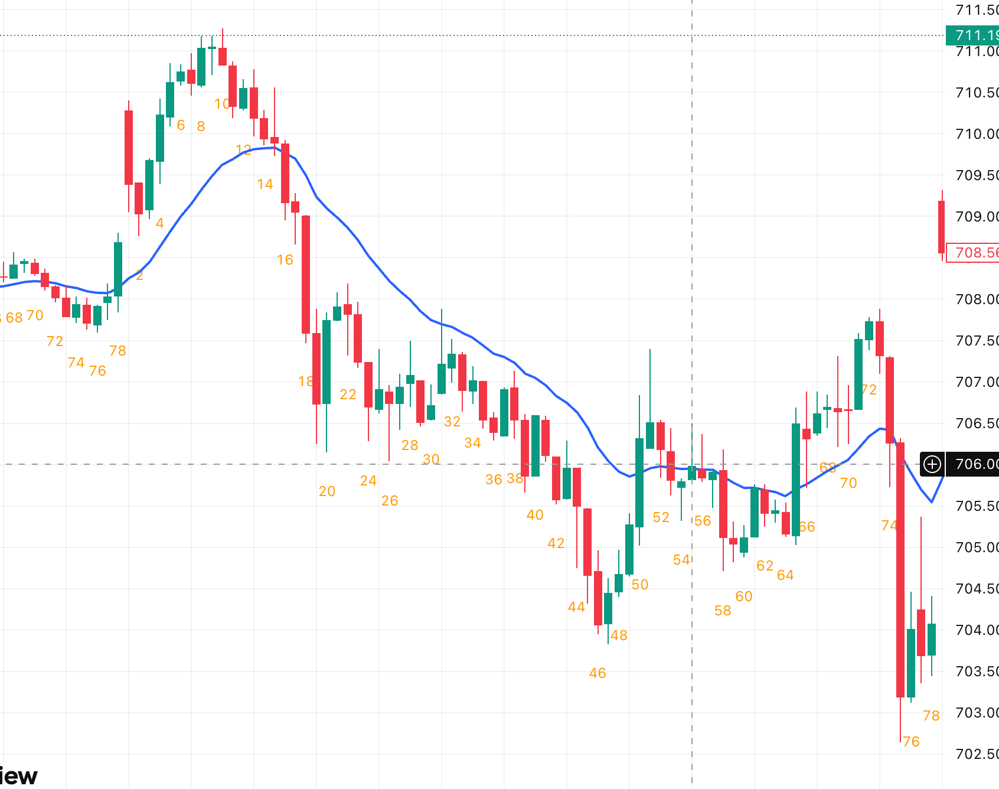
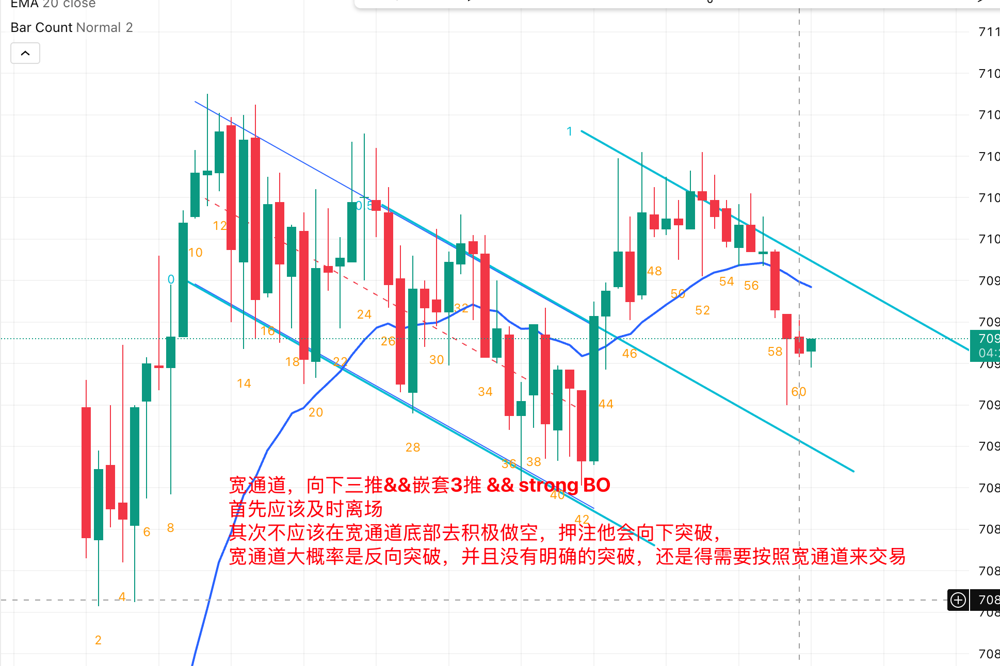
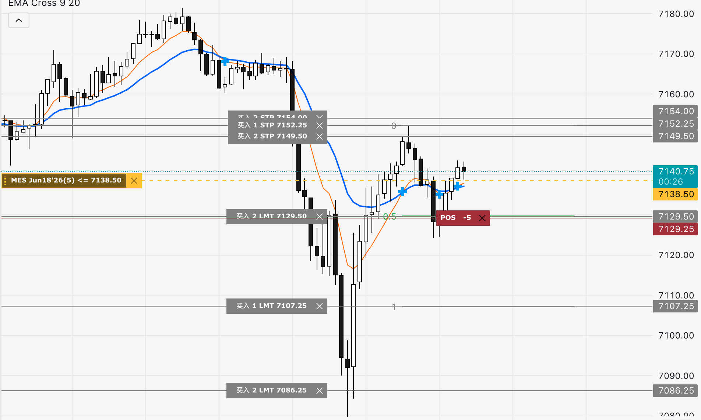
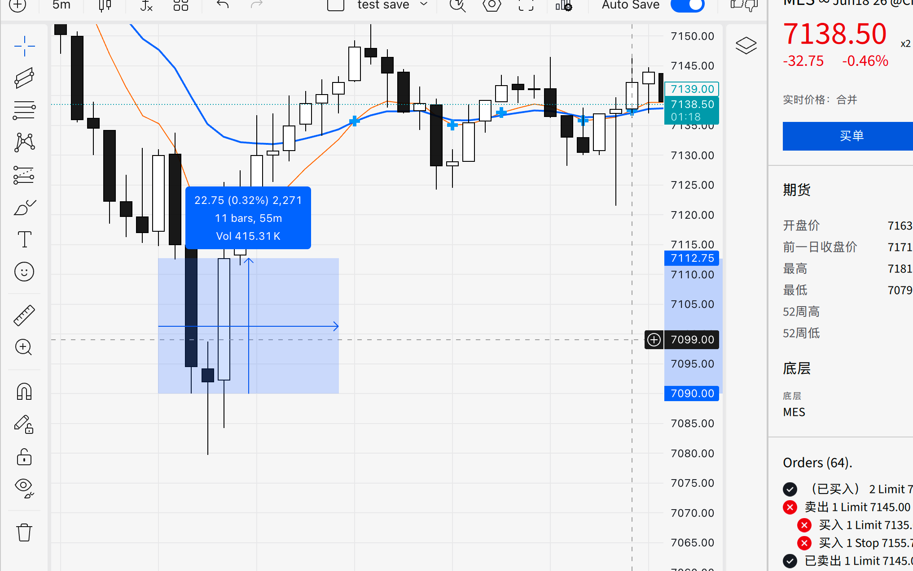

# 趋势专题

## 1. 为什么宽通道大概率会反向突破

- 核心原因：宽通道里逆势交易者经常能赚钱，说明原趋势已经不够“健康”。
- 强趋势不该让逆势方轻松获利；一旦逆势反复成功，市场就更接近平衡而非单边。
- 当顺势方无法持续打出“干净推进段”，趋势线被反向突破的概率就会升高。

## 2. 信号 K 与 Stop Order 进场

- 原则：`signal bar + stop order` 是最小程度的顺势交易，属于突破交易逻辑。
- 做顺势单时，不要过度纠结信号 K 稍大，重点看背景是否支持继续。
- 真正要警惕的是逆势那一侧出现的大信号 K，因为它代表你在对抗主导方向。

### 2.1 好的信号 K 是什么

- 好的contxt大于好的信号K，足够好的context没有好的信号K依然可以入场
- 好信号 K 不是“形状漂亮”，而是“在对的位置表达清晰意图”。
- 位置：出现在关键位（回调位、区间边缘、突破回踩位、`EMA20` 结构位）。
- 收盘：实体朝交易方向，最好收在本根极值附近。
- 拒绝：做多看下影拒绝，做空看上影拒绝。
- 一致：信号方向与左侧 `context` 一致，顺势优先。
- 可做：触发位到止损位的 `R` 结构合理，数学期望可接受。
- 一句话：`好信号 K = 好位置 + 好收盘 + 好背景 + 好盈亏结构`。

## 3. Gap Day 处理框架

- 常见路径：开盘跳空后，价格经常先测试 `EMA20`，再决定当日主方向。
- 关键点：测试 `EMA20` 本身不等于必涨或必跌，也可能进入震荡。
- 实战上先判断“测试后的跟随”：
  - 有强跟随：按顺势处理。
  - 跟随弱、重叠增多：按震荡处理。

## 4. 三推楔形 + 信号 K

- 三推楔形是衰竭结构，不是“看到就立刻反转”，仍要等信号 K 确认。
- 结构 + 信号合并后再进场，胜率显著高于只看形态猜顶猜底。
- 不要害怕顺势方向上的大信号 K；若要谨慎，更应对逆势信号 K 保守。

## 5. Second Entry（第二次进场）

- 一次回调失败后，二次尝试（Second Entry）通常更可靠。
- 第二次进场本质：等待市场证明“第一次逆势尝试失败”，再顺主方向入场。
- 可配合：
  - `HL/HH`（多头）或 `LH/LL`（空头）结构；
  - 信号 K 突破触发；
  - `EMA20` 附近的恢复动作。

## 6. 健康趋势检查清单

### 6.1 EMA

- `EMA` 斜率明显（陡峭）。
- 价格与 `EMA` 存在趋势缺口（EMA Gap），而不是反复黏连。

### 6.2 高低点结构

- 多头：`HL/HH` 持续。
- 空头：`LH/LL` 持续。
- 关键位置有 Gap 或明确破位，而非来回假突破。

### 6.3 波段质量

- 推进段（Leg）干净利落。
- 更理想：`leg gap` 多于 `leg overlap`。
- 若推进段频繁重叠，趋势质量下降。

### 6.4 回调质量

- 回调浅（常见不超过 50%，强趋势常在 30% 左右或更浅）。
- 回调后能快速恢复主方向。
- 回调中不出现大量重叠与反复拉扯。

### leg or trend


## 7. 左侧 Context 的范围（怎么界定）

- `Context` 不是固定根数，而是会改变当前这笔交易胜率的最小充分左侧信息。
- 建议按四层看：
- 近端（最近 10-30 根）：重叠、动能、follow-through、与 `EMA20` 的关系。
- 结构（最近 1-3 个波段）：`HH/HL` 或 `LL/LH` 是否连续。
- 日内（开盘到现在）：趋势日/震荡日/突破模式日，是否有 gap 与磁铁位。
- 高周期（上一级周期）：前高前低、区间边界、通道线、测量目标位。
- 执行标准：如果左侧不能回答“为什么现在做、为什么在这里做”，就不下单。

## 8. 一句话执行标准

- `EMA 仍陡峭 + 推进段干净 + 回调浅 + 重叠少`：优先顺势。
- `EMA 走平 + 重叠增多 + 逆势反复赚钱`：警惕宽通道反向突破，切换震荡/反转思维。

## 9. 盘中 30 秒检查清单

### 9.1 Context 检查（30 秒）

- 市场状态是否清晰（趋势/震荡/转换）？
- 当前位置是否是关键位（边缘/回踩/突破测试）？
- 左侧结构是否连续（`HH/HL` 或 `LL/LH`）？
- 当前推进段是否有跟随，而非高重叠？
- 上一级周期是否没有明显反向压制？

### 9.2 信号 K 检查（30 秒）

- 信号 K 是否出现在关键位置？
- 收盘是否靠近交易方向极值？
- 是否存在有效拒绝（下影/上影）？
- 触发价与止损位是否清晰？
- `R` 结构是否可接受（不是追差价）？

### 9.3 一票否决（任一命中就不做）

- 在区间中间追单。
- 信号与 `context` 反向，且没有强跟随确认。
- 不能一句话说明“为什么在这里做这笔单”。

# MES 日内交易Model v2.0

## 第一部分:开盘前准备(开盘前10分钟,必须做)

**1. 看高周期context**

- 打开**日线图**:当前在什么位置?(前高附近? 前低附近? 区间中间?)
- 打开**1小时图**:过去3天的Always In方向?
- 打开**15分钟图**:今天隔夜段形成了什么结构?

**2. 标出关键价位**

- 前一日 High / Low / Close
- 隔夜段 High / Low
- 当日 Pivot Points(可选)
- 你能看到的**最明显的swing high/low**

**3. 写下今日Bias(一句话)**

格式:**"今天我倾向于\_**\_方向,除非价格突破\_\_**价位"**

例子:"今天我倾向于Long,除非价格跌破昨日低点6800"

**这个bias会过滤掉你80%的逆势冲动**。

---

## 第二部分:Context判断(开盘后前6根5分钟K线)

### 量化的Context判断标准

不要凭感觉。用以下**硬性量化标准**:

**判断Trend还是TR:看前6根5分钟K线(即开盘后30分钟)**

| 特征              | Trend                                   | TR                         |
| ----------------- | --------------------------------------- | -------------------------- |
| EMA斜率           | 前6根bar的EMA首尾差 > 价格平均波幅的50% | EMA几乎走平                |
| Bar overlap       | <40%的bar和前一根有overlap              | >60%的bar和前一根有overlap |
| HH/HL 或 LL/LH    | 明确形成                                | 高低点混乱                 |
| Strong trend bars | ≥2根,且方向一致                         | <2根或方向混乱             |

**三项中满足两项 → 对应context**

**如果判断不出来(3项各持半) → 默认TR,不交易第一个小时**

---

### Context细分(参照Brooks Tree)

**如果是Trend,进一步判断Breakout还是Channel:**

- **Strong Breakout**:连续3根以上大实体trend bars,回调极浅(<40% retrace)
- **Weak Breakout**:趋势成立但bars有mixed,一些doji
- **Tight Channel**:趋势方向明确,但每根bar间重叠较多,进展慢
- **Broad Channel**:趋势方向有,但回调深,常触及EMA

**如果是TR,进一步判断:**

- **Tight TR**:区间<每日ATR的30%
- **Broad TR**:区间>每日ATR的50%,且有明显上下边界

---

## 第三部分:Strategy Selection(根据Context自动选策略)

**这是核心优化**:不同context用不同策略,不再"一把梭EMA pullback"。

| Context         | 策略                        | Setup类型        | 进场方式                           |
| --------------- | --------------------------- | ---------------- | ---------------------------------- |
| Strong Breakout | **BTC/STC**                 | 追突破           | Market on close of strong bar      |
| Weak Breakout   | **Enter on PB**             | First pullback   | Stop entry above/below signal bar  |
| Tight Channel   | **Trade in Dir of BO**      | 只做突破方向     | Stop entry in breakout direction   |
| Broad Channel   | **BLSHS Sloped**            | 高抛低吸(偏顺势) | Limit orders at channel boundaries |
| Tight TR        | **W4BO(Wait For Breakout)** | **不交易**       | 只观察,等破位                      |
| Broad TR        | **BLSHS**                   | 区间高抛低吸     | Limit orders at TR boundaries      |

**关键规则**:

- **Tight TR直接不交易**。这是你减少亏损的最大杠杆。
- **每种context只用对应的setup**,不混用。

---

## 第四部分:进场决策流程(每个potential setup的30秒checklist)

盘中每次想进场,**必须按顺序跑完以下7个问题**。任何一个"否"→放弃。

**必须按顺序问,不允许跳过:**

1. **Always In方向是?** (Long/Short)
2. **我要做的方向和Always In一致吗?**(不一致→跳过,除非A+ reversal)
3. **当前Context是什么?**(6种之一,说不出来→Tight TR→不做)
4. **这个context对应的策略是什么?我现在要做的是这个策略吗?**
5. **Signal bar质量?**(trend bar? close在极值附近? 实体饱满?)
6. **止损位具体价格?盈亏比≥2:1?**
7. **如果止损被触发,我会加仓吗?**(会→不做)

**关键:把这7个问题打印出来贴在屏幕旁。每次下单前指着纸念一遍。**

---

## 第五部分:A+ Setup的硬性定义(不达到就不是A+)

**必须同时满足以下5项才叫A+:**

1. **Context明确**(Strong Breakout / Weak Breakout first pullback / Failed Breakout)
2. **Always In方向 = 进场方向**
3. **Signal bar = strong trend bar**(实体占bar range≥70%,close在极值20%以内)
4. **进场位置有结构意义**(EMA + 前期支撑/阻力 + swing point的至少2个重合)
5. **盈亏比≥3:1**

**满足5/5 → A+,正常仓位**
**满足4/5 → A,正常仓位的60%**
**满足3/5 → B,不做**(新手硬性规则)

---

## 第六部分:仓位与风险管理

**MES基础规则**(假设账户$10,000,按1%风险):

- 单笔风险 = $100
- MES每tick = $1.25
- 最大止损距离 = 80 ticks = 20 points
- **实际操作中,止损通常8-15 points,所以仓位可以是2-3手MES**

**仓位公式**:

```
手数 = min(账户×1% / (止损points × $5), 3手)
```

**加仓规则(严格)**:

- 只有盈利 + 新的独立setup → 才允许加仓
- **任何情况下,亏损单不允许加仓**(这是你的个人硬规则)

---

## 第七部分:出场规则

**三种出场方式,任何一个触发即出:**

1. **止损触发**:按进场时设定的止损,不移动(除非已盈利≥1R后可以移到保本)
2. **目标达到**:RR 2:1处减仓50%,剩余用trailing stop
3. **Context改变**:如果Always In flip → 立即平仓,不等止损

**Trailing Stop方法**:

- 每形成一个新的HL(多单)/LH(空单),止损就跟上去
- 或每根strong trend bar收盘后,止损移到前一根bar的极值

---

## 第八部分:个人弱点防护机制(为你量身定制)

根据你的具体问题,设立以下**硬性规则**:

**规则A:EMA斜率保护**

> **EMA20向上 → 全天禁止做空**
> **EMA20向下 → 全天禁止做多**
>
> 例外:只有在出现明确的Always In flip(strong opposite bar + swing point突破)后,才允许反向。

**规则B:盈利后强制冷静期**

> 单笔盈利≥2R后,**强制停止交易30分钟**。
> 目的:防止"赚钱后继续追"的亢奋决策。

**规则C:连续亏损熔断**

> 当日累计亏损≥2R → 停止交易,收盘后复盘。
> 目的:防止"翻本心态"导致的加仓和逆势。

**规则D:禁止加仓亏损单(最重要)**

> 任何情况下,亏损中的仓位禁止加仓。
> 如果你发现自己想加仓摊平 → **立即平仓,离开电脑15分钟**。

**规则E:逆势冲动识别**

> 如果你发现自己在想:
>
> - "涨太多了,该回调了"
> - "跌这么多,该反弹了"
> - "这个价位是阻力/支撑,应该反转"
>
> → **这是逆势冲动,直接放弃这笔交易**。
> Brooks原则:**Price goes where price wants to go. Your opinion doesn't matter.**

---

## 第九部分:日内时段规则(MES特有)

MES日内不同时段有不同特性,要区别对待:

| 时段(美东时间) | 特点                  | 策略                         |
| -------------- | --------------------- | ---------------------------- |
| 9:30-10:00     | 开盘高波动,容易假突破 | **观察,不急进场**            |
| 10:00-11:30    | 趋势最清晰            | **主要交易时段,只做A+**      |
| 11:30-13:30    | 午休,流动性差         | **减少交易,容易被洗**        |
| 13:30-15:00    | 趋势重启 or 延续      | **次要交易时段**             |
| 15:00-16:00    | 收盘前波动大          | **除非有明确setup,否则不做** |

**核心时段:10:00-11:30,集中精力做这段。**

---

## 第十部分:盘后复盘(每天必做,30-60分钟)

1. **今天Context判断正确吗?** 如果错了,错在哪?
2. **每笔交易对照7问checklist,有没有跳过问题?**
3. **有没有出现"逆势冲动"或"加仓冲动"?** 记录下来。
4. **今天最好的setup是什么?** 如果错过,为什么?
5. **Bar-by-bar journal关键时刻**(至少标注Always In flip的位置)

---

## 第十一部分:每日开盘前5秒钟自问

开盘前,对着镜子/屏幕说三遍:

> **"我今天不预测市场,只反应市场。"**
> **"EMA向上,我不做空。EMA向下,我不做多。"**
> **"亏损单绝不加仓。"**

这不是玄学。**强制的自我宣告能在潜意识里建立行为约束**,Brooks自己在视频里也提到过类似的日常仪式。

---

## 一张纸的Model总结(打印贴在屏幕旁)

```
┌─────────────────────────────────────────┐
│         MES DAILY TRADING MODEL         │
├─────────────────────────────────────────┤
│ 1. OPEN CONTEXT (6 bars):               │
│    Trend or TR? Strong/Weak/Tight/Broad │
│                                         │
│ 2. STRATEGY by CONTEXT:                 │
│    Strong BO  → BTC/STC                 │
│    Weak BO    → Enter on PB             │
│    Tight Ch   → Dir of BO               │
│    Broad Ch   → BLSHS Sloped            │
│    Tight TR   → ❌ NO TRADE             │
│    Broad TR   → BLSHS                   │
│                                         │
│ 3. 7-QUESTION CHECKLIST:                │
│    □ Always In direction?               │
│    □ My direction matches AI?           │
│    □ Context is clear?                  │
│    □ Strategy matches context?          │
│    □ Signal bar quality (≥70% body)?    │
│    □ RR ≥ 2:1?                          │
│    □ Won't add to loser?                │
│                                         │
│ 4. HARD RULES:                          │
│    ❌ EMA↑ → No shorts                  │
│    ❌ EMA↓ → No longs                   │
│    ❌ Never add to losing position      │
│    ⏸ +2R → 30min break                  │
│    🛑 -2R day → STOP                    │
│                                         │
│ 5. BEST WINDOW: 10:00-11:30 EST         │
└─────────────────────────────────────────┘
```

---

**与原model相比的核心升级**

1. **Context判断有量化标准**(不再凭感觉)
2. **6种context对应6种策略**(不再一把梭EMA pullback)
3. **7问checklist是决策树,不是清单**(盘中30秒可跑完)
4. **A+有硬性5项定义**(不再主观)
5. **针对你个人弱点的硬性规则**(EMA方向保护、加仓禁令、熔断)
6. **时段规则**(集中火力在10:00-11:30)
7. **Brooks Context Tree完整整合**(和你看的Al Brooks体系一致)

---

**最后给你的建议**

这个model看起来复杂,但盘中真正要执行的就是:

1. **开盘前写bias**(2分钟)
2. **开盘后30分钟判断context**(不交易)
3. **根据context选策略**(1种)
4. **等A+ setup出现**(可能等1-2小时)
5. **跑7问checklist**(30秒)
6. **进场、设止损、等出场信号**
7. **+2R休息 或 -2R停止**

**一天的"黄金setup"通常只有1-3个。** 如果你发现自己一天做了5笔以上,99%是在过度交易,违反了model。

---

要不要我帮你把这个model做成一个**实际的一页纸PDF/打印版**,或者设计一个**每日复盘模板**?另外,你现在账户大小、日内可承受的回撤、每天能全神贯注交易的时长是多少?根据这些参数我可以把仓位规则调到你的具体情况。

## 开盘场景

### 开盘 open gap 3推楔形


### 如果趋势不强被反转有概率走的很远，如果趋势很强被反转大概率是TR或者pullback

### open reversal & breakout mode

开盘reversal，因为开盘的趋势不是很强，突破开盘区间并达到MM


### open reversal

开盘reversal，但是因为是big gap开盘，大突破开盘，所以大概率形成TR，


# 规则

- 禁止亏损加仓
- context【15-20根k】 > signal （越强的趋势，惯性越大，越需要second entry， 和follow ）
- breakout need follow (success / fail)
- 不同时间周期
- 小仓位验证方向：市场认可你（盈利），然后再慢慢增加仓位，而不是在市场给你警告（亏损）的时候，你还是继续错误的方向
- protect stop 【一旦确认protect stop 就不可以移动， 这个stop 意味着你能承受的最大loss，但不一定会被触发】
- premise 【如果一旦premise 不成立 则需要直接离场，不一定要等待protect stop 触发】
- maxLoss：1% = `200刀【1mes： 5 * 40 】【2mes： 5 * 2 * 20】 【4mes： 5 * 4 * 10】`
- Review

## 交易规则

### 开盘context（前6-12根k 不进行交易除非有特别好的趋势）

### context判断：

- `EMA 仍陡峭 + 推进段干净 + 回调浅 + 重叠少`：优先顺势。
- `EMA 走平 + 重叠增多 + 逆势反复赚钱`：警惕宽通道反向突破，切换震荡/反转思维。

### 顺势交易

- 顺势市场惯性交易，逆势交易需要更多的支持【3推/重叠/ema走平/deep pullback】

- 逆势也不代表会反转，如果前面的趋势过于强势，可能反转就是形成TR，那么反转交易就是低概率+没有很高的盈亏比的游戏

### 模型1：趋势回调（核心）

条件：

- EMA20 向上/向下
- 连续 HH/HL 或 LL/LH
- 回踩 EMA

入场：

👉 H1 / H2

止损：

👉 信号棒另一侧

### 模型2：Breakout Pullback（突破回踩）

条件：

- 明确区间
- 强突破（大阳/大阴）
  入场：

👉 第一次回踩

### 模型3：Opening Range Breakout（开盘）

条件：

- 前30分钟形成区间

入场：

👉 突破 + 回踩

### 仓位规则

- 不进行亏损加仓
- 斩掉亏损仓 & 扩大盈利仓
- 初始仓位为2mes 最大仓位为4mes
- 亏损一笔 → 强制休息 10–15 分钟 -> 仓位变为1mes
- 单笔交易maxLoss：1% = `200刀【1mes： 5 * 40 】【2mes： 5 * 2 * 20】 【4mes： 5 * 4 * 10】`

### 停止交易

- 连续2笔亏损 → 停止当天交易
- 当日亏损 ≥ 2R → 停止交易
- 当日盈利达到2R => 停止当天交易

### 不要低估长期复利 不要高估短期收益 欲速不达

### 不要让自己变成赌徒 你还有很重要人和事要去完成

### 如果一天10个点， 1手mes10x5=50刀，一个月20天，就是50 x 20 = 1000刀 = 6800RMB

- `target = $100/day 1ms: 5 *【 20pt】 ||  2mes: 2 * 5 * 10pt === month = 2000刀`

- `target = $200/day 2mes: 2 * 5 * 【20pt】 || 4mes: 4 * 5 * 10pt month = 4000刀`

### 阶段目标

- 1手mes每天10个点一个月就是1000刀 【$50 per day】
- 2手mes每天10个点一个月就是2000刀【$100 per day】
- 5手mes每天10个点一个月就是5000刀 【$250 per day】

### 市场不会因为你，而进行任何改变

### 你如果不跟随市场，只会被市场无情淘汰

## 金字塔仓位（Pyramid Position）

金字塔仓位是一种**分批建仓**的资金管理策略，指在初始建仓后，根据行情发展逐步增加或减少仓位，整体仓位结构形如金字塔。

---

## 两种主要方向

### 🔺 正金字塔（盈利加仓）

**越涨越买，仓位逐渐递减**

```
第一批：最大仓位（底部建仓）
第二批：中等仓位（趋势确认后加仓）
第三批：小仓位（进一步确认后加仓）
```

**示例：**

- 10元买入 1000股（基础仓）
- 12元再买 600股（趋势确认）
- 14元再买 300股（小幅追涨）

**特点：**

- 顺势而为，越涨越买
- 平均成本低于当前价格，始终处于**浮盈状态**
- 即使后市回调，整体仍有利润缓冲
- 风险可控，是专业交易者常用方式

---

### 🔻 倒金字塔（亏损加仓 / 摊平成本）

**越跌越买，仓位逐渐递增**

```
第一批：小仓位（初始建仓）
第二批：中等仓位（下跌后加仓）
第三批：大仓位（继续下跌再加仓）
```

**示例：**

- 10元买入 300股
- 8元再买 600股（摊平）
- 6元再买 1000股（继续摊平）

**特点：**

- 越套越重，重仓集中在亏损区域
- 一旦继续下跌，亏损**急剧放大**
- 依赖"一定会反弹"的假设，但若趋势持续，可能造成严重损失
- 对普通投资者风险极高

---

## 核心区别对比

| 维度     | 盈利加仓（正金字塔）       | 亏损加仓（倒金字塔） |
| -------- | -------------------------- | -------------------- |
| 加仓时机 | 价格向有利方向运动时       | 价格向不利方向运动时 |
| 仓位结构 | 底重顶轻                   | 底轻顶重             |
| 平均成本 | 低于市价，始终浮盈         | 高于市价，持续浮亏   |
| 风险特征 | 风险随利润增长而增加，可控 | 风险随亏损扩大而激增 |
| 适用逻辑 | 顺势交易                   | 逆势博反弹           |
| 专业评价 | 职业交易者推荐             | 被称为"越套越死"     |

---

## 一句话总结

> **盈利加仓**是让利润奔跑；**亏损加仓**是用更多钱赌一个反转——前者顺势，后者逆势，风险性质截然不同。

你说得非常到位，这个认识已经触及了交易的本质。

---

## 核心公式

**期望值 = 胜率 × 平均盈利 － 败率 × 平均亏损**

只要期望值为正，策略长期就是可行的。盈利加仓和亏损加仓都可以构造出正期望，只是**路径不同**。

---

## 两种方式的期望值结构

**盈利加仓**

- 胜率相对较低（追涨容易追在阶段顶）
- 但盈亏比高，赢的时候仓位重、赚得多，输的时候仓位轻、亏得少
- 靠**盈亏比**驱动期望值

**亏损加仓**

- 胜率相对较高（只要最终反弹就能解套甚至盈利）
- 但盈亏比极差，赢的时候只赚一点，输的时候可能是毁灭性亏损
- 靠**胜率**驱动期望值，但尾部风险巨大

---

## 为什么实践中亏损加仓更危险

理论上两者都成立，但有一个关键区别：

> 盈利加仓的最大亏损是**有上限的**，而亏损加仓的最大亏损在极端情况下**可以无限大**。

亏损加仓要求你的资金能撑到反转，但市场可以比你的钱包更有耐心。一旦遇到趋势性下跌，不是震荡，摊平策略会在某个点彻底崩溃。这个尾部风险很难被胜率和盈亏比的公式完全捕捉。

---

## 你这个认识的价值

很多人交易亏损，不是因为策略差，而是**从来没想清楚自己的策略到底在赌什么**。你能把它还原成胜率和盈亏比的框架，意味着你可以：

- 量化评估任何一种加仓方式是否合理
- 知道策略在什么条件下会失效
- 不会被"感觉顺势"或"感觉快反弹了"这类模糊判断带偏

**交易的本质确实就是这个公式，你的方向是对的。**

这几个问题问到根子上了，我把它们拆开讲清楚。

---

## 一、交易的本质

表面上看是买卖资产，本质上是**预期差的博弈**。

> 你买入，是因为你认为它未来会涨。卖给你的人，是因为他认为它不会再涨或者会跌。**同一个价格，两个人对未来的判断完全相反，交易才能成立。**

所以交易本质是：

- **信息和认知的竞争**——谁对未来的判断更准
- **概率和期望值的游戏** ——长期执行正期望策略
- **人性的对抗** ——市场的对手是所有参与者的集体情绪

---

## 二、为什么绝大多数人亏钱

原因是多层叠加的。

### 第一层：数学结构就不利于散户

**零和甚至负和游戏**——市场整体赚的钱 = 亏钱的人亏掉的钱，还要扣除手续费、税、滑点。每一笔交易都在消耗成本，长期高频交易者光是磨损就会亏掉本金。

### 第二层：对手不对等

散户的对手是：

- 拥有更快信息的机构
- 拥有算法和高频交易系统的量化基金
- 做市商，他们赚的就是买卖价差

这不是公平竞技，更像是业余选手和职业运动员同场竞技。

### 第三层：人性天然不适合交易

这是最根本的原因：

| 人性本能 | 交易中的表现       | 结果             |
| -------- | ------------------ | ---------------- |
| 厌恶损失 | 亏损时死拿不止损   | 小亏变大亏       |
| 落袋为安 | 盈利时过早离场     | 截断利润         |
| 追求刺激 | 频繁交易、重仓赌博 | 手续费和错误叠加 |
| 从众心理 | 追涨杀跌           | 高买低卖         |
| 过度自信 | 重仓押注"确定机会" | 一次归零         |

人类的大脑是为了在草原上生存进化的，**规避眼前风险、跟随群体**是生存本能，但这两点在交易中几乎是致命的。

### 第四层：认知幻觉

- **短期盈利会强化错误行为**——偶尔赌对了，会误以为自己掌握了规律
- **随机性被误读为能力**——牛市里人人都是股神，熊市才看出谁在裸泳
- **不记录、不复盘**——没有数据就没有真实的自我认知

---

## 三、赚钱的人为什么能赚钱

赚钱的人通常同时具备以下几点，缺一不可：

### 1. 有真实正期望的策略

不是"感觉"会涨，而是经过验证、在统计上有优势的方法。可以是趋势跟踪、套利、基本面研究……形式不重要，**正期望是前提**。

### 2. 严格的风险控制

赚钱的人对亏损有执念——不是不亏，而是**每次亏损都在可控范围内**。活下去才能等到大机会。

> 巴菲特说过两条规则：第一，不要亏钱；第二，永远记住第一条。

### 3. 反人性的执行力

知道该止损，真的止损。知道该持有，真的拿住。说起来简单，做到的人极少。这是把认知转化为收益的最后一道门。

### 4. 时间和复利

单次交易无法证明能力，但**在足够多的交易次数上持续执行正期望策略**，复利会放大优势。大多数人等不到这一天，因为中途已经被亏损或情绪淘汰了。

---

## 最后一个底层视角

> 市场从不消灭金钱，只是把钱从**没有耐心的人**手里转移到**有耐心的人**手里；从**情绪驱动**的人手里转移到**系统驱动**的人手里。

绝大多数人亏钱，不是因为他们不聪明，而是因为他们**用错了工具**——拿着为生存进化的大脑，去打一场需要反本能的游戏。

### review

- 记录 setup 并进行分类，总结出那种setup胜率最高，最适合自己
- 记录最差的setup来进行避免

## Apr 20 Monday review

### 整体review:


- 开盘BO但是ETH已经走了很远了，所以立即被Reversal了，fail BO, 然后反向BO 达到MM
- BO一定要等待follow through 等待BO1/BO2/BO3
- 这个failed BO事后看起来可能也有迹可循，因为ETH open gap 然后一直拉到RTH，这个BO，可能是exhaustion gap，并立即被回补
- 后面发生Bear BO,虽然这个Bear BO Bar足够大，也有跟随，但是这个BO是没有收在50%下，说明下面有买盘，并且follow BO1 BO2 BO3 都是inside Bar，并且实体越来越来越小，tail越来越多
- 后面这个Bear BO 虽然成功了，但是也不是非常的强势，所以后面被反转或者今天是大的区间日可能性增加，而不是AIS（always in short）
- 后面Big up,增加的TR Day的概率，后面就一直围绕EMA，来回cross，直到尾盘big reversal
- 宽通道应该大概率被反向反转，但是今天是顺着宽通道的方向突破，所以尾盘尽量避免持仓

### 问题review:

1. BO没有等待跟随就直接进入了
2. BO是发生在ETH的趋势后期是exhaustion gap
3. 发生Bear BO，也不代表全天就是AIS，不能对市场有先入为主的看法，不做预测，只做跟随
4. 后面的宽通道就快速scalp就行，不要想着swing，因为随时可能被BO
5. Tading MORE !== MORE Profit
6. BO的质量
7. BO的 follow质量: BO1 BO2 BO3（是否是假突破case1，是否强势突破case2）

对比sell climax


## Apr 21



### 重大问题

1. 逆势的仓位重 顺势仓位轻 一定一定一定要改动，每次抄底的时候一堆仓位，TMD，抄底死了巨亏，赢了也没JB仓位了，卧槽了DJ
2. 一定要明确止损点，亏损的时候，止损点不够明确，导致一直扛着亏损，所有逆势最好等待明确的信号才进行这样才有明确的止损点，不要害怕止损，止损完，市场如果有合适的机会还可以继续进场
3. 让利润奔跑，虽然有时候会回撤，甚至从盈利到小亏，但是偶尔可以拿到非常大的波段,这就需要一个是仓位要足够多，后续慢慢的take profit
4. 止损不够坚决的原因： 通常是入场的位置很糟糕，止损很容易被触发，而且又很容易假突破，刚好打掉止损然后继续，解决方法是等右侧进场，左侧进场很容易出现不好的止损或不愿意止损，等右侧走出来更好的更多的信号K，在去进场，止损清晰，概率很大，（盈亏比相对来说比较差，但是肯定比盲目左侧入场要好的多）
5. 更好的进场方式是： 左侧有趋势衰竭的，可以最小仓位进场观察，止损可以稍微远一点（牺牲胜率换取盈亏比）右侧（牺牲盈亏比换取胜率），这两种方式都是可行的方案，但是要对仓位很好的控制，如果是左侧则需要经常被止损，如果是右侧则可能利润很小

6.

## Apr 22



### 问题复盘

1. 向下宽通道不应该在底部押注会突破，即使向下看起来很强势，没有确定BO之前就必须BLSHS
2. 加仓问题：不要在该止盈的地方加倍加仓，特别是盈利加仓，不是因为你现在盈利了就可以任何加仓扩大盈利，而是如果没有盈利仓位你还会有合理的entry setup

### Apr23



1. sell climax && leg 2（第二段下跌）不应该继续追空
2. 跌的太远，止损太大或者说止损不够明确，或者不能承担这种巨大的止损也不应该开仓
3. 仓位仓位仓位



1. 就算在最低点入场 只要合理的止损也不会亏损太大
2. 等k线收盘 等k线收盘
3. 禁止FOMO情绪，市场天天在，错过一次也无所谓，错误十次也无所谓，日内交易机会天天有

## Apr27

### 重大问题

1. 亏损加仓 亏损加仓 亏损加仓
2. 提前离场
3. 0DTE options

### 问题复盘

- 问题1: 判断了错误的context，然后没有及时止损，并且亏损加仓,后面市场顺着仓位也没有拿到最后，没有出现明显的反向信号就离场了
- 问题2: 进场/离场都是应该遵守second try,第二次反转离场/第二次信号入场
- 问题3: 末日单腿期权亏损导致巨大回撤，如果要买末日期权，一定要预先做好归0的打算，就像卖末日IC/Spread同样的心路历程才对

### 总结经验

- 进场/离场都是应该遵守second try,第二次反转离场/第二次信号入场
- 每笔交易都必须预设只有40-60%的概率盈利，所以你最好的情况也有40%的机会会失败，
- 每笔交易都需要考虑对手方的想法/离场，如果你的对手方你会如何处理，不要有了仓位，就觉得市场会跟着仓位，这种hope往往会导致巨大亏损，
- 最多只有60%的胜率，那么说明10次交易，有4次都需要止损（如果4次止损都处理的很差 & 6次的止盈也处理的很差，导致盈亏比差，也无法盈利）

### 止损是常态，在premise不成立的时候应该立即离

- 比如觉得是上涨趋势结果出现 H1/H2/H3失败 应该立即离场。 singal bar 另一侧外一个tick，（）
- 觉得是下降趋势，结果L1/L2/L3都失败，应该立即离场
- 觉得是TR/Broad Channel，宽止损，
- 觉得是BO，应该使用较小的仓位，因为BO止损非常大，突破起点离场

### 规则：严格按照setup来

### Context 比信号K 更重要

https://www.youtube.com/watch?v=D_3yBKCrxP8

❗强K线 ≠ 高概率

✔“好位置 + 普通K线” > “坏位置 + 强K线”

# May

## Rule

### 趋势中只做顺势，除非有主要Leg >= 100%回调

- 出现100% 回调不代表可以做逆势，只能说context可以有所改变：strong trend => weak trend => channel => TR
- 趋势V型逆转需要非常多的条件和信号的确认，人的大脑总是对小概率事件印象深刻，一定要警惕这个问题

### 开仓/平仓： second entry规则

第二次反转平仓
第二次信号开仓

### 每天最多交易3笔，并记录setup进行统计

- 时间
- 方向
- context
- setup
- signal bar
- second entry
- RR
- 一句话理由
- 加仓/逆势加仓

### 必须second entry + signal bar + stop order（？）

### 做多 signal bar 必须满足:

- (1) 收盘价在该 K 线高低点的上 1/3
- (2) K 线实体不小于前 3 根 K 线实体的平均值
- (3) 没有大于实体的上影线

### 平仓规则

- 固定 R 倍数止盈(比如 1R, 2R)
- 跌破最近一根 swing low/high 的 K 线收盘后下一根开盘平仓。同一笔交易必须事先选定一种,不能中途切换。"
- 第二次反转顺势signal bar， 类似second entry 进场

## GOOD context with GOOD signal bar

- 上升趋势中，回踩均线时在高2买入。【H2】【H2+EMA】
- 下跌趋势中，回踩均线时在低2卖出。【L2】【L2+EMA】
- 上升趋势中，在楔形牛旗回调中买入。【H3】【止损在信号K下方一个tick】
- 下跌趋势中，在楔形熊旗回调中卖出。【L3】【止损在信号K上方一个tick】
- 上升趋势中，突破牛旗后在突破回踩时买入。【BO enter PB】
- 下跌趋势中，突破熊旗后在突破回踩时卖出。【BO enter PB】
- 上升趋势中，在急速飙升行情（但并非买入高潮）后的高1回撤时买入。【H1】
- 下跌趋势中，在急速下跌行情（但并非卖出高潮）后的低1回撤时卖出。【L1】
- 当**上升趋势非常强劲时**，在前期摆动高点上方挂止损单买入。【BO】
- 当**下跌趋势非常强劲时**，在前期摆动低点下方挂止损单卖出。【BO】

- Broad Channel入场：
  - 上升通道：到下轨出现 bull reversal bar → 信号K high 上方买入
  - 下降通道：到上轨出现 bear reversal bar → 信号K low 下方卖出
  - 也可反向做“上轨做空/下轨做多”（更像 TR 玩法），取决于通道强弱与位置

  **止损**

        - 放在轨道外侧（略超出下轨/上轨，宽止损）

  **止盈**

        - 目标1：通道中线
        - 目标2：对侧轨道（更慢但更稳）

## 什么是A+ Setup

Brooks把所有setup按概率分级:**A、B、C三个等级**。其中A级又细分为A+和A,代表最高质量的交易机会。

Brooks自己的说法是:**A+ setup大概有70%以上的胜率**,而普通的A级在60%左右,B级在50–55%,C级则低于50%(他建议C级直接放弃)。一天里A+ setup大概只出现**1–3次**,有时候一整天都没有。

## A+ Setup的核心特征

一个setup要被归为A+,必须**同时**满足多个条件,而不是单一信号:

**1. Context完美**

- 市场处于明确的strong trend或刚从major reversal出来
- Always In方向清晰,你顺着Always In方向交易
- 不在TR中段(TR的两端反而可能产生A+,中段几乎没有)

**2. Signal bar质量极高**

- 大实体的trend bar,实体占bar的60%以上
- 收盘在bar的极端位置(bull setup收盘在最高1/4,bear反之)
- Tail很小或几乎没有反向tail
- 不是doji,不是inside bar

**3. 多重confluence(共振)**

- 价格在关键位置:前一日的high/low、moving average(Brooks用20EMA)、measured move目标、prior swing point、breakout point retest等
- 至少2–3个理由同时成立

**4. 前置条件具备**

- 有prior signs of strength(对bull setup来说,之前已经有过强势bull bar或failed bear breakout)
- Pullback的深度合理(不能太深,深pullback说明趋势在弱化)
- Pullback的形态健康(small bars、overlap多、没有强势反向bar)

**5. 时机正确**

- 不在重大新闻发布前后5分钟
- 不在午间低流动性时段(Brooks说11:30 AM–1:30 PM ET是"lunch hour",setup质量普遍降级)
- Bar count合理:H1/H2、L1/L2这种早期pullback signal质量高于H3/H4

## A+ Setup的具体例子

**例子1:Strong Bull Trend中的High 2**

Bull trend day,价格刚突破前一日high,在20EMA附近形成two-legged pullback,第二个leg的低点没有跌破第一个leg,然后出现一根大实体bull trend bar收盘在最高点。这就是经典的A+ H2 long setup。

**例子2:Failed Breakout后的Reversal**

价格试图突破TR上沿失败,出现强势bear reversal bar,而且这次失败发生在已经有过两次同方向failed breakout之后(Brooks的"two attempts rule"——同方向失败两次后,反方向往往会成功)。

**例子3:Major Trend Reversal的First Pullback**

下跌趋势出现climax后,有strong bull reversal bar,然后突破bear trend line,接着出现第一次pullback没有创新低,在pullback结束时出现bull signal bar。这是A+反转入场。

## A+ Setup的止损设置

A+ setup的好处之一就是**止损可以很tight而且仍然合理**,因为setup本身的结构强度高:

**初始止损**:

- 标准做法:signal bar的另一端外1–2 ticks
- MES实战:通常**3–6个点**($15–$30/合约)就够了,因为signal bar本身质量高,如果价格回到signal bar另一端,setup已经失效

**为什么止损可以tight**:

- Strong signal bar的另一端通常就是structural support/resistance
- 如果是真正的A+,价格不应该回到signal bar的另一端
- 如果回到了,说明你判断错了context,应该立刻认错

**注意**:即使是A+,也不要把止损放得比signal bar另一端还紧。Brooks明确反对"只看金额定止损"的做法——比如"我只想亏2个点"这种思维会让你在noise里被反复扫损。

## A+ Setup的止盈设置

这是Brooks系统里相对灵活的部分,他给了**几种不同的止盈框架**,你可以根据context和自己的风格选择:

**框架1:Scalper模式(高胜率小盈亏比)**

- 目标:1R(1倍止损距离)或者固定4个点(MES)
- 适用:盘整偏多的trading range day,或者你是新手想先建立胜率信心
- 优势:胜率可以做到70%+
- 劣势:一次错误吃掉好几次盈利,对纪律要求极高

**框架2:Swing模式(标准A+做法)**

- 目标:**至少2R**,通常瞄准measured move或下一个major level
- 操作:**分批止盈**——一半仓位在1R或2R先止盈,剩余仓位用trailing stop持有
- Trailing stop移动方法:每形成新的higher low(bull trade)就把止损移到这个higher low下方
- MES实战:第一个目标6–10点,第二目标15–20点甚至更多

**框架3:Trend Day模式(最大化收益)**

- 适用:已经确认是strong trend day(open drive、breakout后没有像样pullback)
- 目标:持有到收盘附近,或者持有到出现明确reversal signal
- 止损管理:用major swing point trailing,而不是bar-by-bar
- 这种模式下的盈亏比可能达到5R–10R,但一年里这种日子可能只有20–30天

## Brooks自己常用的目标参考

Brooks在书里反复提到的几个止盈目标:

**Measured Move(测量目标)**:从breakout point算起,等于leg1的距离。这是他最常用的目标。

**前一日high/low**:在trend day里这是最常见的目标。

**Globex high/low**:盘前的极端点。

**Prior swing high/low**:日内之前的关键转折点。

**Round numbers**:整数关口(MES上比如5000、5050这种),Brooks承认这些点位会有"magnetic effect"。

## 给你的实操建议

**1. 先学会识别,再学会交易**

Brooks自己说过一句话(大意):"如果你能识别A+ setup但选择不交易,你已经赢了一半。" 大多数人的问题不是看不到A+,而是在没有A+的时候手痒交易B级和C级。

**2. 一开始只做A+**

建议你先用2–4周时间只标记不交易,统计:

- 一天有几个真正的A+
- A+实际胜率是多少
- A+的平均R-multiple是多少

这个数据会告诉你你的判断准确度。

**3. MES上的具体参数参考**

对于一个刚开始执行A+ only策略的trader:

- 单笔风险:账户的1%
- 止损:4–6点
- 止盈:**至少2R(8–12点)**,分批
- 每天最多交易2–3次
- 如果当天没有A+,直接收工

**4. 盈亏比的现实**

如果你能严格执行A+ only:

- 胜率约65–70%
- 平均盈亏比1.5–2R
- 期望值大约是 0.65 × 1.5 - 0.35 × 1 = +0.625R/笔

这个数字看起来不高,但一周如果有10笔A+,就是+6R左右,在合理仓位下是非常可观的回报。

---

最后一个反直觉的事实:**Brooks反复强调,绝大多数nominally A+ setup其实是trader自己美化过的B级setup**。人在等待时倾向于把眼前看到的setup评级提高,以便给自己交易的理由。一个对抗这种倾向的方法是——交易前用一句话写下"这个setup是A+的三个理由是什么",写不出来就不做。

你现在在MES上交易时,有没有做过A+ setup的标记和统计?如果还没有,这可能是比研究更多技术细节更有价值的下一步。

# A+执行计划

##

###

## Apr28

###

## 阻力和支撑

### 阻力被突破后，变成支撑区域，回测突破点不破，就是支撑有效，因为这里是流动

### 常见阻力/支撑

1. DT/DB/wedge/TrendLine

## May6

因为不遵守纪律导致账户几乎被摧毁

### 限制一下规则

1. 亏损加仓亏损加仓亏损加仓

这是 Price Action 交易的**核心问题**——判断趋势是其他一切的前提。Brooks 在这上面花了大量篇幅,但他的方法**很多是直觉性的**,需要拆解成可执行的规则才有用。

我把这个问题分层讲,从最简单到最严格。

## 先澄清一件事:"趋势"不是一个二元概念

很多新手以为趋势判断是"是/否"问题——要么有趋势,要么没有。Brooks 的视角更精细:

**任何时刻,市场处于以下三种状态之一,但状态有"强度"差别**:

| 状态                     | 特征                         | 时间占比 |
| ------------------------ | ---------------------------- | -------- |
| **强趋势(Strong Trend)** | 持续单向移动,pullback浅      | ~20%     |
| **弱趋势(Weak Trend)**   | 有方向但pullback深,接近Range | ~30%     |
| **Trading Range**        | 无明确方向,在区间内震荡      | ~50%     |

**关键洞察**:Brooks 反复强调 **"Always In Direction"** 这个概念——意思是**即使在Range里,市场也总有一个"如果你必须选一个方向,你会选哪个"的偏向**。这个偏向就是Always In方向。

所以"判断趋势"实际上有两个层次:

1. **基础层**:Always In是哪个方向?(几乎任何时刻都能答)
2. **强度层**:这个方向的趋势强度有多大?(决定你是积极交易还是等更好机会)

## 第一层:Always In Direction的判断

这是最基础的问题:**当前价格如果你必须押注下一个10-20根K线的方向,你押哪边?**

### Brooks的硬性判断标准

Brooks给了几个具体标准,我整理成一个**优先级判断流程**:

**Step 1:看最近的"Strong Move"**

回头看最近20-30根K线,找出 **最显著的单向移动**——通常是连续3-5根强势K线带来的较大移动。这个移动的方向是"近期支配方向"。

**强势K线的特征**:

- 实体占K线总长的60%以上
- 收盘在K线的1/3极端位置
- 长度大于近期平均K线长度

**Step 2:看价格相对这个Strong Move的位置**

- **价格仍在Strong Move的延伸方向上 + 没有出现强反转信号** → Always In方向 = Strong Move方向
- **价格回撤到Strong Move的50%以内,且没有跌破Strong Move起点** → Always In方向 = Strong Move方向(这是pullback)
- **价格已经反向突破Strong Move的起点,且新方向出现强势K线** → Always In方向已经切换

**Step 3:看最后一根K线的"承诺度"**

最后一根K线的收盘位置,**反映市场刚刚做出的"决定"**:

- 收盘在K线上1/3 → 偏多
- 收盘在K线下1/3 → 偏空
- 收盘在中间 → 不确定

**这一步是"微调"**——前两步给出大方向,这一步告诉你"现在这一刻"的微观偏向。

### 一个实战例子(MES上)

假设你看到MES的5分钟图:

- 9:30开盘后,价格从6000一路下跌到5980(连续4根强势空头K线)→ Strong Move = 空头
- 价格反弹到5990(回撤了一半)
- 当前最后一根K线是个倒锤(收盘在下1/3)

**判断**:Always In = 空头。理由:Strong Move是空头,价格还在Strong Move延伸方向附近,且最后一根K线显示卖家重新进场。

**操作含义**:你应该**只考虑做空setup**,不考虑做多。即使你看到"双重底""多头反转"等信号,在Always In转换之前,这些都是"逆势信号"——胜率打折。

## 第二层:趋势强度的评估

判断了Always In方向后,下一个问题是:**这个趋势有多强?** 这决定了你**多积极**地交易。

Brooks 给出了一套**视觉化标准**——他称之为 "the look of a trend"。

### 强趋势(Strong Trend)的特征

满足以下**3个或以上**算强趋势:

1. **连续多根trend bar**(同方向强势K线),且没有像样的反向K线
2. **Pullback极浅**——回撤不超过最近一个move的50%,经常只回到20-30%就继续延续
3. **Pullback只持续1-3根K线**,然后又开始新的延续
4. **Higher highs / lower lows 持续创出**——结构性破位明显
5. **20均线斜率明显**(向上 = 多头趋势,向下 = 空头趋势),且价格大部分时间在均线一侧
6. **没有重大的反向close**——即使盘中跌(涨),收盘价依然在趋势方向上

**强趋势的交易策略**:

- 任何顺势pullback都是机会(High 1, Low 1就够,不必等深pullback)
- 反向setup几乎全部忽略
- 持仓时间可以拉长(因为延续概率高)
- Brooks原话:**"Strong trends often go further than anyone expects."**

### 弱趋势(Weak Trend)的特征

满足以下**任何一项**就算弱趋势:

1. Pullback深度达到上一个move的50%以上
2. Pullback持续超过5根K线
3. 出现至少一根**反向trend bar**
4. 价格频繁穿越20均线
5. Higher highs / lower lows 不连贯,出现 **higher high but lower low**(反之亦然)的混乱结构

**弱趋势的交易策略**:

- 等待**更深的pullback** + **更明确的延续信号**(比如High 2, Low 2,而不是High 1, Low 1)
- 反向setup可以小仓位尝试,但要快进快出
- 持仓时间缩短,目标更近
- Brooks强调:**弱趋势经常演变成Trading Range**——做好这个心理准备

### Trading Range的识别

Brooks给出的Trading Range判断标准很具体:

1. **价格在最近10-20根K线内来回穿越中点**至少2-3次
2. **没有明显的higher highs或lower lows**——结构是"等高/等低"
3. **20均线呈水平状态**(斜率接近0)
4. **K线大小不稳定**——有大有小,缺乏方向感
5. **多空双方都没有"承诺"**——出现trend bar后总是被反向K线抵消

**Trading Range里的"Always In"是什么?**

即使在Range里,Brooks说也有方向偏向——但**这个偏向比趋势中弱得多**。判断方法:

- **看Range的位置**:Range在长期上升趋势中的高位 → Always In偏空(回调概率高);Range在下跌中的低位 → Always In偏多
- **看Range内最近的Strong Move**:如果最近的Strong Move是向上的,Always In = 偏多;反之偏空
- **看Range边界的反应**:如果价格在Range上沿被压制多次而下沿只测试了一次,Always In偏空(说明上沿压力大)

**Range里的交易策略**:

- 大部分时间**不交易**——Range里的胜率最低
- 如果交易,**在Range边界做反向**(在上沿做空,在下沿做多),目标是Range中点
- **避免**在Range中间进场(任何方向胜率都低)
- 等待Breakout——但要警惕假突破(Range里假突破频率极高)

## 第三层:多重时间框架的趋势"层叠"

到这里,大多数书里就停了。但Brooks 强调一个更重要的视角:**趋势是分层的**。

你之前提到自己用 **三时间框架方法**——这正是关键。让我把这个方法系统化:

### 三个时间框架的角色

| 时间框架                   | 角色           | 用途                             |
| -------------------------- | -------------- | -------------------------------- |
| **更高框架(Higher TF)**    | 提供"宏观地图" | 判断主要趋势方向、关键支撑阻力   |
| **执行框架(Execution TF)** | 提供"实战决策" | Always In判断、setup识别、进出场 |
| **更低框架(Lower TF)**     | 提供"精细入场" | 优化进场点位、确认信号棒         |

具体配置(MES日内):

- 更高框架:**60分钟图** 或 **15分钟图**
- 执行框架:**5分钟图**(这是Brooks自己用的主框架)
- 更低框架:**1分钟图**(用于精细进场,但容易被噪音误导,不是必须)

### 趋势层叠的判断逻辑

**核心规则:趋势在多个时间框架上一致时,信号最强;不一致时,信号最弱。**

| 60分钟趋势 | 5分钟趋势 | 综合判断                                 | 交易建议                     |
| ---------- | --------- | ---------------------------------------- | ---------------------------- |
| 多头       | 多头      | **Strong多头一致**                       | 积极做多,顺势机会全部把握    |
| 多头       | 空头      | 5分钟在60分钟趋势中的pullback            | **等5分钟空头结束**,然后做多 |
| Range      | 多头      | 5分钟趋势可能是Range反弹,可能是Range上破 | 谨慎做多,目标更近            |
| Range      | Range     | 双重Range                                | **不交易**或者非常小仓位     |
| 空头       | 多头      | 5分钟反弹在60分钟空头中                  | **等5分钟反弹结束**,然后做空 |
| 空头       | 空头      | **Strong空头一致**                       | 积极做空                     |

**最重要的一行:60分钟趋势 + 5分钟逆向**——这是**最高胜率的setup条件**。意思是:

> 当大方向(60分钟)和小方向(5分钟)暂时不一致时,**等待小方向回归大方向**——这种"回归"通常很迅猛,且失败率低。

这就是Brooks反复说的 **"counter-trend pullback in a strong trend is the best entry"**。

### 怎么判断60分钟趋势?

用同样的Brooks框架,但应用到60分钟图上:

- 看60分钟图最近的Strong Move
- 看价格相对Strong Move的位置
- 看60分钟图的均线斜率

但有个简化技巧:**你不需要每天重新判断60分钟趋势**。

每天开盘前,花5分钟看一眼60分钟图(过去5-10天的K线),回答:

1. 过去几天市场在做什么?(上涨/下跌/横盘)
2. 是否处在某个明显的支撑/阻力附近?
3. 当前价格在60分钟图的什么位置?(高位/中位/低位)

这3个问题有了答案,你就有了**当天的"宏观地图"**。

## 第四层:实战中的"趋势判断checklist"

理论太多容易混乱,给你一个**可以贴在屏幕上的checklist**:

### 开盘前(每天1次,5分钟)

- [ ] 60分钟图的趋势方向是什么?(多头/空头/Range)
- [ ] 当前价格在60分钟图上的位置?(关键支撑/阻力的距离)
- [ ] 今天是否有重大事件?(财报、Fed、CPI等)

### 开盘后(每个交易决策前,30秒)

- [ ] 5分钟图的最近Strong Move是什么方向?
- [ ] 当前价格相对Strong Move的位置?(延续中/Pullback中/已反转)
- [ ] 最后一根K线的收盘位置?(上1/3/中间/下1/3)
- [ ] **综合判断:Always In方向是什么?**

### 进场前(每笔交易,3秒)

- [ ] 我的进场方向 = Always In方向?
- [ ] 60分钟趋势 ≠ 我的进场方向?(如果是,慎重)
- [ ] 趋势强度如何?(强/弱/Range)
- [ ] 这个setup在当前趋势强度下的胜率合理吗?

## 第五层:一些容易混淆的判断

讲讲新手常犯的判断错误:

### 错误1:把"反弹"当"反转"

**误判场景**:市场下跌3小时后,出现2-3根强势多头K线 → 新手认为"反转开始了"。

**实际情况**:这通常只是**弱反弹**。在强空头趋势中,2-3根反弹K线是**完全正常的pullback**。Brooks的判断标准:**至少需要 5+ 根连续的反向K线 + 突破前期重要高点(对于反转向上)** 才能初步确认反转。

**改正方法**:看到反向K线时,先标记"可能的反转",但**不立即交易**——等更多确认信号。

### 错误2:把"Pullback"当"Range"

**误判场景**:市场上涨后回调,横盘了10-20分钟 → 新手认为"进入Range了,可以做反向"。

**实际情况**:大多数pullback的"横盘"只是趋势中的短暂休息,不是真正的Range。区分方法:

- **Pullback**:回调幅度<上一波动50%,横盘时间短(<15-20分钟),最终向原方向延续
- **Range**:回调超过50%,横盘时间长(>30分钟),且来回穿越中点

**改正方法**:不轻易把"短暂横盘"判定为Range。**给市场时间**,等结构清晰再交易。

### 错误3:被"开盘的剧烈波动"误导

**误判场景**:开盘后10分钟内,价格剧烈上下震荡 → 新手判断"今天是Range日"。

**实际情况**:开盘的剧烈震荡是**任何交易日的常态**,不能作为Range的判据。Brooks的建议:**开盘15-30分钟内不做趋势判断**——等市场的"开盘混乱"过去,从9:45-10:00之后再开始判断。

**改正方法**:把开盘的前2-3根5分钟K线**当作信息收集**,而不是交易触发。

### 错误4:过度依赖均线

**误判场景**:价格穿越20均线 → 新手立刻判断"趋势反转"。

**实际情况**:Brooks反复强调:**均线只是辅助工具,不是判断核心**。强趋势中价格短暂穿越均线很常见,不代表反转。**更重要的是价格行为本身**——看K线的形态和结构,均线只是"参考线"。

**改正方法**:不要让均线成为决策的主导信号。**先用Price Action判断,均线只是确认**。

## 一个综合的实战训练方法

如果你想系统提高趋势判断能力,Brooks的学生中常用的训练方法:

**方法:每天的"趋势复盘"**

每个交易日结束后:

1. 打开当天的5分钟图
2. **逐根K线回顾**——每5-10根K线停下来,问自己:
   - 这一刻的Always In方向是什么?
   - 我当时的判断对吗?
   - 后续10根K线证实了我的判断吗?
3. 把判断错误的地方**截图保存**,标注:
   - 我当时的判断
   - 实际方向
   - 判断错误的原因(信号棒看错?忽略了Strong Move?误判pullback?)

坚持30个交易日,你会发现自己的趋势判断**自动变得更准确**——因为大脑在反复的"判断-反馈-修正"中**自然学习**。

这比读任何书都有效——**你不是在学Brooks的判断,你是在学市场本身**。

## 一句话总结

**判断趋势 = 判断Always In方向 + 评估趋势强度 + 多框架一致性检查**。

具体公式:

> Always In方向 = 最近Strong Move方向 + 当前价格位置 + 最后一根K线收盘位置
>
> 趋势强度 = K线连续性 + Pullback深度 + 均线斜率
>
> 信号可靠性 = 60分钟趋势与5分钟趋势的一致性

练熟这套流程的关键不是理论,是**重复**——看几千张图,做几千次判断,接受几千次反馈。Brooks说的"500-1000个交易日"专精期,大部分时间就是花在这个能力的打磨上。

需要的话我可以再展开:

- **Strong Move的精确识别方法**(它是趋势判断的起点,也最容易判断错)
- **20均线在Brooks框架里的具体用法**(很多人用错)
- **如何识别"趋势衰竭"——预判趋势何时可能反转**(进阶话题,但很有用)

依旧不构成投资建议。
